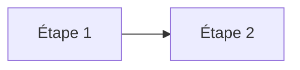

# Formation Dev IA — Plateforme Next.js

Plateforme web Next.js pour consommer la formation **Dev IA Sénior — Next.js + Vercel + Agents (avril 2026)** depuis n'importe où, avec :

- Lecture confortable desktop / mobile / dark mode
- Sidebar de navigation, table des matières par module, scroll-spy
- 13 modules + annexes (état de l'art, Next.js/Vercel, AI SDK 6, agents, RAG, evals, sécurité, jobs, repo template, roadmap, **context engineering**, **process équipe**)
- Diagrammes Mermaid embarqués dans le contenu
- 9 diagrammes React Flow interactifs (page dédiée)
- Code highlighté (Shiki) avec bouton copier
- Progression sauvegardée localement (sans compte)

## Stack

- **Next.js 15** (App Router, RSC, Server Components)
- **React 19** + **TypeScript** strict
- **Tailwind CSS** + `@tailwindcss/typography`
- **react-markdown** + `remark-gfm` pour le rendu MD
- **Shiki** pour le code highlight
- **Mermaid** pour les diagrammes inline
- **@xyflow/react** (React Flow v12) pour les diagrammes interactifs
- **next-themes** pour dark/light/system
- **@phosphor-icons/react** pour l'iconographie

## Démarrer en local

```bash
npm install
npm run dev
# http://localhost:3000
```

Build de prod :

```bash
npm run build
npm start
```

## Déployer sur Vercel

### Option 1 — UI Vercel (le plus simple)

1. Push ce repo sur GitHub / GitLab / Bitbucket.
2. Sur [vercel.com/new](https://vercel.com/new), importez le repo.
3. Vercel détecte Next.js automatiquement (framework + build commands).
4. Cliquez **Deploy**. Aucune variable d'env nécessaire — tout est statique.

### Option 2 — CLI Vercel

```bash
npm i -g vercel
vercel
# Suivre les prompts ; aucune env var requise
vercel --prod
```

Le build est entièrement statique (pas d'API runtime, pas de DB). Le déploiement est gratuit en plan Hobby, instantané (les pages sont prerenderisées via `generateStaticParams`).

## Structure

```
devai/
├── app/
│   ├── (reader)/
│   │   ├── layout.tsx              # Sidebar + main
│   │   ├── page.tsx                # Accueil (liste modules)
│   │   ├── m/[slug]/page.tsx       # Lecteur de module
│   │   ├── diagrammes/page.tsx     # Diagrammes React Flow
│   │   └── parcours/               # Suivi de progression (client)
│   ├── globals.css
│   ├── layout.tsx                  # Root layout + ThemeProvider
│   └── not-found.tsx
├── components/
│   ├── sidebar.tsx
│   ├── markdown.tsx                # Renderer principal
│   ├── mermaid.tsx                 # Mermaid client component
│   ├── code-block.tsx
│   ├── toc.tsx                     # TOC + scroll-spy
│   ├── theme-toggle.tsx
│   ├── theme-provider.tsx
│   ├── progress-button.tsx
│   ├── module-nav.tsx              # Prev/next navigation
│   └── diagrams/
│       ├── flow-base.tsx           # Wrapper React Flow + nodes typed
│       ├── multi-agent.tsx
│       ├── rag-pipeline.tsx
│       ├── vercel-stack.tsx
│       ├── repo-architecture.tsx
│       ├── agent-decision.tsx
│       └── cost-stack.tsx
├── lib/
│   ├── modules.ts                  # Charge content/*.md
│   ├── highlight.ts                # Shiki highlighter
│   └── utils.ts
├── content/
│   ├── 00-etat-de-lart-2026.md
│   ├── 01-nextjs-vercel-prod.md
│   ├── ...
│   └── annexes-sources.md
├── next.config.ts
├── tailwind.config.ts
├── tsconfig.json
├── vercel.json
└── package.json
```

## Modifier le contenu

Tous les modules sont dans `content/*.md`. Modifiez-les directement, le rendu se met à jour au refresh (en dev).

Pour ajouter un module :
1. Créez `content/<numero>-<slug>.md`.
2. Ajoutez l'entrée dans `MODULE_DEFS` de `lib/modules.ts`.
3. Le module apparaît automatiquement dans la sidebar et l'index.

### Mermaid

```` 

````

Le rendu Mermaid est client-side (lazy loaded) et s'adapte au thème dark/light.

### Code highlighting

```` 
```typescript
const x: number = 42;
```
````

Highlight Shiki avec le thème `github-dark-default` / `github-light-default`. Bouton copier au hover.

### Liens internes vers d'autres modules

Dans un fichier MD, utilisez `[texte](./05-rag-moderne.md)` ou `[texte](/m/05-rag-moderne)`. Le renderer convertit automatiquement les liens `./xx.md` vers les routes `/m/xx`.

### Liens vers des diagrammes React Flow

Pointez sur `/diagrammes#<anchor>`, par exemple :

- `/diagrammes#vercel-stack`
- `/diagrammes#multi-agent`
- `/diagrammes#rag-pipeline`
- `/diagrammes#cost-stack`
- `/diagrammes#repo-architecture`
- `/diagrammes#agent-decision`

## Personnaliser

- **Couleurs / theme** : variables CSS dans `app/globals.css` (`--accent`, `--bg`, `--fg`, etc.).
- **Polices** : changez `Inter` / `JetBrains_Mono` dans `app/layout.tsx`.
- **Logo / titre** : `components/sidebar.tsx`.
- **Modules** : ordre et hooks dans `lib/modules.ts` (`MODULE_DEFS`).

## Pas de tracking, pas de compte

La progression est sauvée dans `localStorage` (`devai:progress`). Aucun cookie tiers, aucune analytics par défaut. Si vous voulez tracker l'usage :

- Ajoutez Vercel Analytics : `npm i @vercel/analytics` puis `<Analytics />` dans `app/layout.tsx`.
- Ou Plausible / Umami / Fathom selon préférence.

## Licence du contenu

Le contenu (`content/*.md`) est compilé à partir de sources publiques citées dans `content/annexes-sources.md`. Reproduction libre pour usage personnel et formation interne. Citations obligatoires pour reproduction publique.

## Crédits techniques

- shadcn/ui pour les patterns de composants
- Vercel pour Next.js, React Flow team pour `@xyflow/react`
- Mermaid, Shiki, react-markdown
- Phosphor Icons
