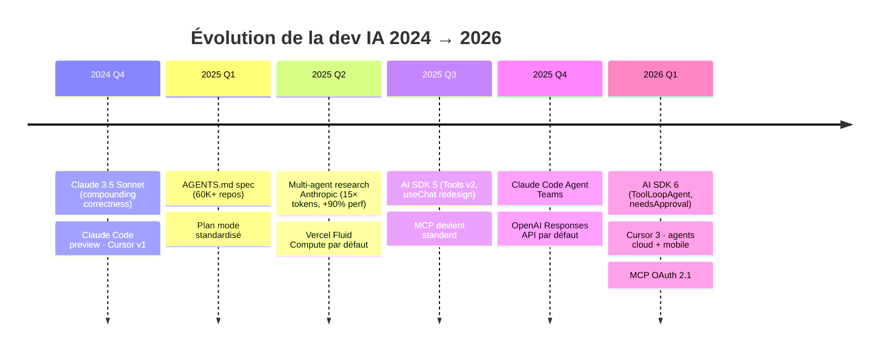

# Module 00 — État de l'art en avril 2026

## Le marché en chiffres

Le coding agents est passé d'un marché de niche à ~6 milliards de dollars d'ARR concentrés sur trois acteurs (source : *Latent Space — AIE Europe Debrief, mars 2026*) :

- **Claude Code** : ~2,5 G$ ARR
- **OpenAI Codex** : ~2 G$ ARR
- **Cursor** : ~2 G$ ARR

Ce qui se passe en interne dans ces boites est plus instructif que les chiffres publics :

- **Cursor** : 35 % des PR mergées proviennent d'agents cloud autonomes.
- **Anthropic** : 80 à 90 % du codebase de Claude Code est écrit par Claude (Boris Cherny, *Pragmatic Engineer*, mars 2026). Boris ship 20–30 PR / jour en faisant tourner 5 instances Claude en parallèle.
- **Spotify** : depuis décembre 2025, plus aucun humain n'écrit le code de production ; ~650 PR IA / mois mergées, –90 % de temps sur les migrations.
- **StrongDM (« Software Factory »)** : règles internes — *« le code n'est ni écrit ni reviewé par un humain »*. Coût : ~1 000 $ de tokens / dev / jour. Rendu possible par l'arrivée de Claude 3.5 Sonnet (oct. 2024) qui a passé un seuil de "compounding correctness" sur les tâches longues.

## Les transitions clefs depuis 2024

| Transition | Avant | Maintenant | Implication sénior |
|---|---|---|---|
| **Persona du dev IA** | "Vibe coder" / autocomplete inline | Concepteur de systèmes d'agents | Le bottleneck devient l'architecture, plus la vitesse de frappe |
| **Unité de travail** | Le fichier / la fonction | Le PR / la feature complète | Les évals et la gouvernance gagnent en valeur |
| **Côté framework** | Vercel AI SDK comme un wrapper streaming | Pile complète : Core, UI, Gateway, MCP, Agent class | L'orchestration est une compétence à part entière |
| **Côté infra** | Serverless classique avec timeouts à 10s | Vercel Fluid Compute (CPU actif facturé), Sandbox | Les workloads I/O bound (LLM) deviennent économiquement viables |
| **Côté workflow** | Tutoriel + assistance IA | Plan mode → review → exec → verify | La compétence rare est le system design pour agents |
| **Standardisation des prompts repo** | `.cursorrules`, `CLAUDE.md`, `copilot-instructions.md` séparés | `AGENTS.md` unique (Linux Foundation, 60 K+ repos) | Une seule source de vérité tool-agnostique |
| **Côté observabilité** | Logs + metrics classiques | OpenTelemetry GenAI semantic conventions | Tracer un agent multi-étapes nécessite une instrumentation explicite |

## Ce qui est *prouvé* en prod (à adopter)

- **Plan mode + review du plan** — la pratique unique avec le plus gros ratio bénéfice/coût (cité par les staff engineers Anthropic, Cursor, Vercel).
- **Hooks comme garde-fous déterministes** — le seul mécanisme qui *garantit* un comportement (CLAUDE.md est advisory).
- **MCP pour l'accès aux outils** — convergence de l'écosystème, OAuth 2.1 standardisé en mars 2026.
- **AI code review (Greptile, CodeRabbit) en advisory + merge-required** — sans gating bloquant sur les commentaires individuels.
- **Évals comme gate CI** sur les régressions de prompt et le mutation score.
- **Parallel sessions via worktrees / agent teams** pour le debugging adversarial et la fan-out research.
- **Prompt caching agressif** (90 % de réduction sur Anthropic, 50 % sur OpenAI) — non négociable au-delà de quelques milliers d'appels / jour.
- **Hybrid RAG (dense + BM25 + rerank + contextual retrieval)** : le naïf "embed → cosine → stuff" est ouvertement considéré comme un prototype.

## Ce qui est *hype-leaning* (à manier avec prudence)

- **Spec-driven dev pour tout** — fonctionne pour les features > 2 jours de boulot, overkill pour les fixes de typo. Faros AI 2025 : 75 % des devs adoptent l'IA, *aucun gain de vélocité mesurable* dans la majorité des orgs sans gouvernance.
- **« Dark factories » sans review humain** — réel à StrongDM/Spotify, mais reposant sur une infra de scénarios + jumeaux numériques que la majorité des orgs n'ont pas construite.
- **Multi-agent partout** — coûte ~15× plus de tokens qu'un single-agent. Si votre eval delta est < 10 %, le single-agent + meilleurs outils gagne.
- **RAG sur tout** — sur les codebases, `glob` + `grep` + le raisonnement du modèle bat souvent le RAG (Anthropic l'a vérifié sur leur propre code).
- **Switch frénétique de modèle sans baseline d'évals** — ne fonctionne que si vous avez une suite de régression. Sinon on découvre les régressions en prod.

## Les quatre métacompétences sénior 2026

1. **Décomposition du travail** — savoir identifier les morceaux self-contained, où placer les gates de review, quel agent spécialisé doit faire quoi.
2. **Context engineering** (≠ prompt engineering) — gérer ce qui entre dans la fenêtre de contexte avec des artefacts persistants (skills, fichiers de progress, sub-agents isolés).
3. **Eval-driven dev** — instrumentation, error analysis, LLM-as-judge calibré contre des labels humains, gates en CI.
4. **System design pour agents** — façon dont un repo, une org, une CI sont structurés pour que les agents soient productifs sans se marcher dessus.

## Le mantra à garder en tête

> *"La compétence rare en 2024 était de prompter. La compétence rare en 2026 est le system design pour agents."*

Le reste de l'observatoire détaille comment construire ces compétences sans dépendre d'une pile framework particulière.

## Prochains pas

- **Si vous voulez l'angle workflow** : sautez à [03-workflow-agents-dev.md](./03-workflow-agents-dev.md).
- **Si vous voulez le pitch coût** : [07-cout-securite-perf.md](./07-cout-securite-perf.md) ouvre les yeux sur la facture mensuelle.
