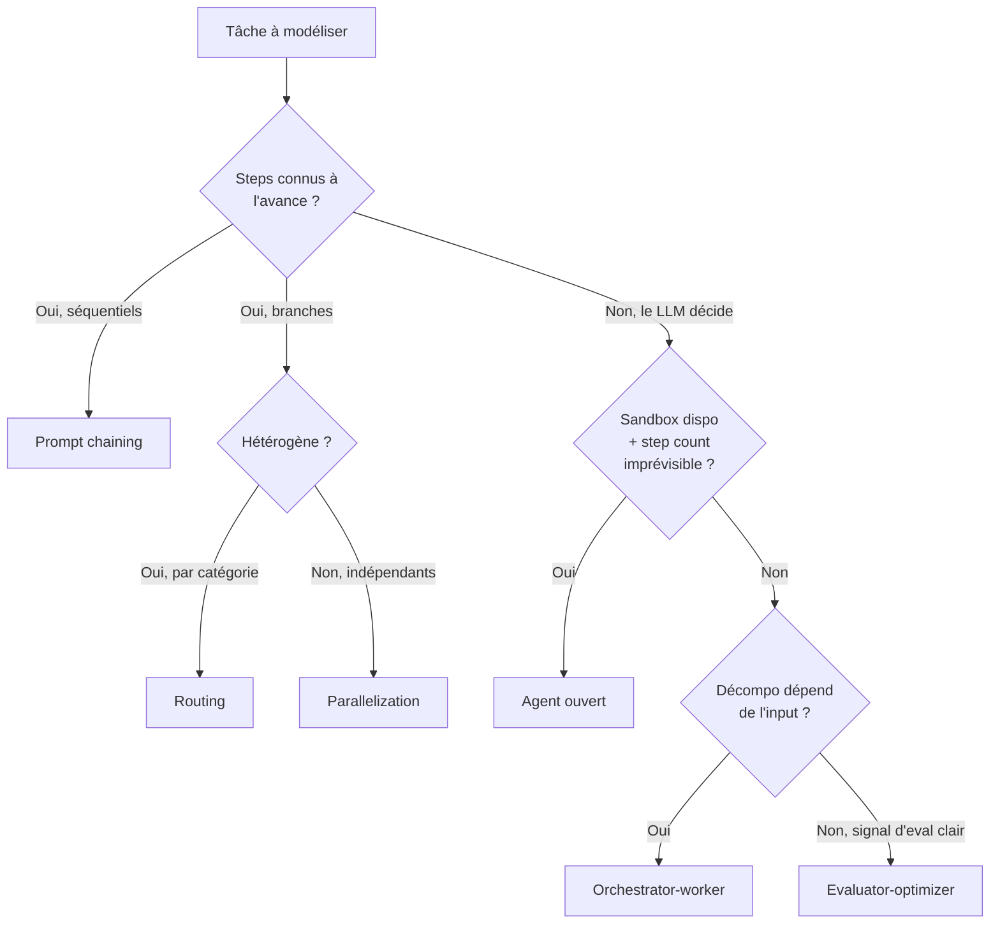

# Module 04 — Patterns multi-agents en production (Avril 2026)

> Source canonique : Anthropic engineering, *Building Effective Agents* (déc. 2024, refresh 2025) et *Multi-Agent Research System* (juin 2025).

## 1. Workflow vs Agent — la ligne fondamentale

> **Workflow** : LLMs et tools orchestrés via des chemins de code prédéfinis.
> **Agent** : LLM qui dirige dynamiquement son propre process.

Choisir un workflow d'abord, escalader à un agent quand le path ne peut pas être fixé.

C'est la dichotomie qu'Anthropic a popularisée et que tout le monde utilise désormais. Elle est plus utile que la frontière "single-agent vs multi-agent" parce qu'elle vous force à demander : *est-ce que je sais à l'avance les étapes ?*



## 2. Les cinq primitives workflow (par complexité croissante)

### 2.1 Prompt chaining

Décomposition séquentielle fixe avec gates programmatiques entre les steps.

```typescript
// Draft → traduction → vérification
const draft = await generateText({ model, prompt: `Write blog post about ${topic}` });
const translated = await generateText({ model, prompt: `Translate to French:\n${draft.text}` });
if (await passesQualityGate(translated.text)) {
  await publish(translated.text);
}
```

**Quand l'utiliser** : la tâche se décompose proprement (draft → translate → verify). Vous savez à l'avance le séquencement.

### 2.2 Routing

Classifier l'input, envoyer à un downstream prompt/model spécialisé.

```typescript
// Le levier coût classique : route 80% du trafic à Haiku, escalade les cas durs à Sonnet/Opus
const route = await generateObject({
  model: "anthropic/claude-haiku-4.5",
  schema: z.object({ category: z.enum(["billing", "tech", "general"]) }),
  prompt: `Classify: ${query}`,
});
const handler = {
  billing: billingAgent,
  tech: techAgent,
  general: generalAgent,
}[route.object.category];
return handler.generate({ prompt: query });
```

**Quand l'utiliser** : queries hétérogènes nécessitant des handlers différents. Un classifier cheap permet d'utiliser des modèles cheap sur la majorité du trafic et de réserver les modèles chers aux cas durs.

### 2.3 Parallelization

Sectioning (subtasks indépendantes) ou voting (N samples pour la confiance).

```typescript
// Sectioning : code review parallèle
const [security, perf, style] = await Promise.all([
  generateText({ model, prompt: `Security review:\n${diff}` }),
  generateText({ model, prompt: `Performance review:\n${diff}` }),
  generateText({ model, prompt: `Style review:\n${diff}` }),
]);
const synthesis = await generateText({
  model,
  prompt: `Combine these reviews:\n${security.text}\n${perf.text}\n${style.text}`,
});
```

```typescript
// Voting : N samples avec majority pour la modération de contenu
const samples = await Promise.all(
  Array.from({ length: 5 }, () =>
    generateObject({
      model,
      schema: z.object({ verdict: z.enum(["approve", "reject"]), reason: z.string() }),
      prompt: `Moderate: ${content}`,
    })
  )
);
const verdict = majorityVerdict(samples);
```

**Quand l'utiliser** : sectioning quand les subtasks sont vraiment indépendantes ; voting quand vous avez besoin de signal de confiance.

### 2.4 Orchestrator-worker

Un LLM central décompose dynamiquement ; les subtasks ne sont *pas* prédéfinies.

```typescript
const plan = await generateObject({
  model,
  schema: z.object({
    steps: z.array(z.object({
      id: z.string(),
      task: z.string(),
      depends: z.array(z.string()),
    })),
  }),
  prompt: `Plan: ${goal}`,
});
const results = await runDag(plan.object.steps, async (step) =>
  workerAgent.generate({ prompt: step.task }),
);
```

**Quand l'utiliser** : tâches multi-fichiers SWE-bench-style ; le contenu de la décomposition dépend de l'input. Un peu plus expressif que pure routing.

### 2.5 Evaluator-optimizer

Boucle generator/critic.

```typescript
let draft = await writer.generate({ prompt });
for (let i = 0; i < 3; i++) {
  const critique = await generateObject({
    model,
    schema: z.object({ pass: z.boolean(), feedback: z.string() }),
    prompt: `Evaluate:\n${draft.text}`,
  });
  if (critique.object.pass) break;
  draft = await writer.generate({
    prompt: `${prompt}\n\nFeedback:${critique.object.feedback}`,
  });
}
```

**Quand l'utiliser** : tâche avec signal d'eval discriminant. Sans signal de qualité réel, la boucle diverge.

## 3. Quand passer à un vrai agent (open-ended loop)

Réservé aux problèmes où :

- Le step count est imprévisible.
- Un sandbox existe pour exécuter en sécurité.
- Le workflow ne peut pas modeler la tâche.

> Anthropic explicit : les agents sont *expensive, error-compounding, et seulement justifiés quand les workflows ne peuvent pas modeler la tâche*.

```typescript
// Pseudocode : agent loop
let messages = [{ role: "user", content: userQuery }];
for (let step = 0; step < MAX_STEPS; step++) {
  const response = await llm.generate({ messages, tools });
  messages.push({ role: "assistant", content: response.content });

  if (response.tool_calls.length === 0) break;
  const toolResults = await Promise.all(
    response.tool_calls.map(call => executeTool(call))
  );
  messages.push({ role: "tool", content: toolResults });
}
```

L'AI SDK 6 fait ça pour vous via `streamText` + `stopWhen: stepCountIs(N)`. Le ToolLoopAgent du module 02 est l'abstraction réutilisable.

## 4. Anthropic Multi-Agent Research — chiffres et leçons

L'article *Multi-Agent Research System* (Anthropic Engineering, juin 2025) est le seul case study public détaillé d'un système multi-agent en prod (le système qui power Claude Research). Les chiffres clefs :

### Économie des tokens

- **Les systèmes multi-agents utilisent ~15× plus de tokens qu'un chat simple.**
- Mais ils délivrent **+90,2 % d'amélioration** sur les évals research vs single-agent.
- *"Token usage by itself explains 80% of the variance"* en capability — c'est-à-dire qu'on ne peut pas prendre les 90 % sans les 15× tokens.

### Parallélisme

- Les subagents firent 3+ tool calls simultanément ; coupent le wall-clock recherche jusqu'à –90 %.

### Failure modes vus en prod

- Orchestrator spawnant 50 subagents pour des queries triviales.
- Subagents qui search infiniment des sources inexistantes.
- Duplicate work entre siblings (les agents convergent sur les mêmes citations faciles).
- Agents préférant SEO content farms aux sources autoritatives.

### Mitigation

> Le lead agent doit spécifier `objective + output format + tool/source guidance + boundaries` *par* subagent. Sans boundaries explicites, les agents parallèles convergent sur les mêmes citations faciles.

## 5. Pattern orchestrator-worker production

```typescript
// Orchestrator (Sonnet) plan, fan-out vers workers (Haiku), synthétise
const plan = await sonnet.plan({ query, schema: PlanSchema });

const workerResults = await Promise.all(
  plan.subtasks.map(task =>
    haiku.run({
      objective: task.objective,
      outputFormat: task.format,        // contrat structuré
      tools: task.tools,                 // tool set narrowé
      boundaries: task.scope,            // empêche la duplication
      maxSteps: 10,                      // hard ceiling
    })
  )
);
const synthesis = await sonnet.synthesize({ plan, workerResults });
```

Notion (Notion blog 2025) a remplacé les prompt chains task-specific par un single central reasoning model coordinant des sub-agents modulaires qui search Notion, Slack, web, edit databases, et synthétisent. C'est l'orchestrator-worker à scale SaaS.

## 6. Décision "j'ai vraiment besoin du multi-agent ?"

Les questions à se poser (dans cet ordre) :

1. **Est-ce qu'un single-agent + meilleurs tools résout le problème ?** Si oui, faites ça. Le multi-agent ne devrait pas être votre default.
2. **Est-ce que le coût en tokens (~15×) est justifié par l'eval delta ?** Sans eval delta mesuré, vous brûlez du cash.
3. **Est-ce que le DAG des subtasks tient en routing/sectioning ?** Si oui, restez en workflow primitive (routing/parallelization).
4. **La décomposition dépend de l'input ?** Si oui, orchestrator-worker. Sinon, sectioning suffira.
5. **Avez-vous un signal d'eval discriminant ?** C'est le prérequis pour evaluator-optimizer.

## 7. Failure modes communs et mitigations

| Failure | Symptôme | Mitigation |
|---|---|---|
| **Spawning explosion** | Orchestrator crée 50 subagents pour 1 query simple | Cap dur sur le nombre de subagents par lead ; classifier de complexité avant spawn |
| **Infinite search** | Subagent ne s'arrête pas, citations bidons | `stepCountIs(N)` strict ; tool de "give up" explicite ; `finalAnswer` tool obligatoire |
| **Duplicate work** | Siblings citent les mêmes sources | Boundaries explicites par subagent (scope géographique, temporel, sectoriel) |
| **Easy-source convergence** | Tout le monde trouve SEO content | Tool/source guidance dans le prompt subagent (ex: "skip blog posts < 6 months old") |
| **Context dilution** | Lead context se remplit de raw subagent output | Subagent retourne summary 1–2K tokens, jamais le transcript |
| **Wrong-cost handler** | Tâches simples routées au modèle cher | Classifier router avec haiku + observabilité par modèle |
| **Cascading failure** | Une étape fail, tout casse | Try/catch par worker, synthèse partielle plutôt que crash |

## 8. Recipe : agent de recherche prod-grade

```typescript
import { ToolLoopAgent, stepCountIs, generateObject } from "ai";
import { z } from "zod";

// ── 1. Sub-agent de recherche (workers Haiku)
const researcher = new ToolLoopAgent({
  model: "anthropic/claude-haiku-4.5",
  instructions: `You are a research worker.
Search and return citations only.
Stop after 5 sources or when confident.
Format: structured JSON with quote + url + relevance score.`,
  tools: { webSearch, fetchUrl },
  stopWhen: stepCountIs(8),
  callOptionsSchema: z.object({
    objective: z.string(),
    outputFormat: z.string(),
    sourceGuidance: z.string(),
    boundaries: z.string(),
  }),
  prepareCall: ({ options, ...settings }) => ({
    ...settings,
    instructions: `${settings.instructions}

OBJECTIVE: ${options.objective}
SOURCE GUIDANCE: ${options.sourceGuidance}
BOUNDARIES: ${options.boundaries}
OUTPUT FORMAT: ${options.outputFormat}`,
  }),
});

// ── 2. Orchestrator (Sonnet) qui plan + synthétise
async function research(query: string) {
  // Plan
  const plan = await generateObject({
    model: "anthropic/claude-sonnet-4.5",
    schema: z.object({
      subtasks: z.array(z.object({
        id: z.string(),
        objective: z.string(),
        sourceGuidance: z.string(),
        boundaries: z.string(),
      })).max(6),  // CAP : empêche le spawning explosion
    }),
    prompt: `Plan research subtasks for: ${query}.
Each subtask must be self-contained, with explicit boundaries to avoid overlap.`,
  });

  // Fan-out
  const workerResults = await Promise.all(
    plan.object.subtasks.map(task =>
      researcher.generate({
        prompt: task.objective,
        callOptions: {
          objective: task.objective,
          outputFormat: "JSON: { citations: [{ quote, url, relevance }] }",
          sourceGuidance: task.sourceGuidance,
          boundaries: task.boundaries,
        },
      })
    )
  );

  // Synthesize
  const synthesis = await generateObject({
    model: "anthropic/claude-sonnet-4.5",
    schema: z.object({
      summary: z.string(),
      citations: z.array(z.object({ quote: z.string(), url: z.string() })),
      gaps: z.array(z.string()),
    }),
    prompt: `Synthesize research:\n${JSON.stringify(workerResults.map(r => r.output))}`,
  });

  return synthesis.object;
}
```

Points à noter :

- Cap dur de **6 subtasks max** dans le schema.
- `stepCountIs(8)` par worker.
- Boundaries explicites passées au worker via `callOptions`.
- Output structuré (Zod) pour l'orchestrator (sans free-text souillant le contexte synthesis).
- Synthesis voit les outputs des workers, pas leurs transcripts.

## 9. Cost-aware patterns

| Lever | Saving | Quand |
|---|---|---|
| **Router cheap → expensive** | 50–80 % | Trafic hétérogène |
| **Prompt caching agressif** (cf. Module 07) | 90 % (Anthropic) / 50 % (OpenAI) sur prefix répété | Long system prompt + tool defs partagés |
| **Batch API** | 50 % | Pipelines async (24h SLA OK) |
| **Sliding window context** | Variable | Conversations longues |
| **Subagent isolation** | Évite la dilution context | Multi-agent toujours |
| **Compaction périodique** | Variable | Sessions long-running |

## 10. Trade-offs qui mordent

- **Multi-agent n'est pas gratuit** : 15× tokens. Si votre eval gain est < 10 %, single-agent + meilleurs tools gagne.
- **Orchestrator-worker n'est pas un graphe DAG figé** ; le DAG est *décidé par le LLM* à runtime. Plus expressif, plus risqué.
- **Voting nécessite des samples vraiment indépendants** (température élevée) ; sinon vous votez avec le même biais N fois.
- **Evaluator-optimizer diverge** sans signal d'eval réellement discriminant. Validez votre evaluator contre des labels humains.
- **Parallel subagents convergent sur les mêmes citations faciles** sans boundaries explicites — c'est *le* failure mode multi-agent le plus commun.

## Ce qu'il faut emporter de ce module

1. **Workflow > Agent** : le default. N'escaladez à un agent que quand le step count est imprévisible.
2. **Les 5 primitives** (chaining, routing, parallelization, orchestrator-worker, evaluator-optimizer) couvrent 90 % des besoins.
3. **Multi-agent coûte 15× tokens pour ~90 % de gain de capability** ; sans eval delta mesuré, ça brûle du cash.
4. **Routing avec un classifier Haiku** est le levier coût qui n'a pas d'inconvénient.
5. **Boundaries explicites par subagent** est l'unique mitigation contre la convergence sur les sources faciles.
6. **Cap dur sur le nombre de subagents** par lead — empêche le spawning explosion.

Module suivant : [05-rag-moderne.md](./05-rag-moderne.md) — comment construire un RAG qui ne soit pas qu'un prototype embarrassant.
