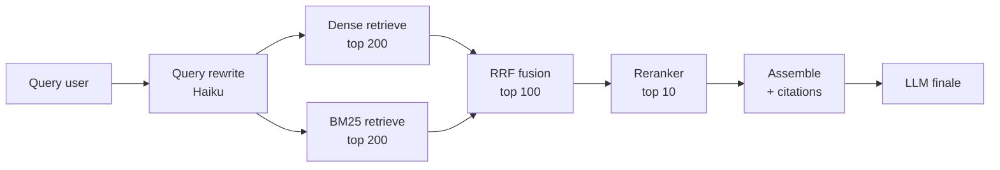

# Module 05 — RAG moderne en production (Avril 2026)

> Le RAG naïf "chunk → embed → cosine → stuff" est ouvertement considéré comme un prototype en 2026. Ce module couvre ce qu'on fait *vraiment* en prod.

## 1. Pourquoi le RAG naïf échoue

Échecs connus du naïf :

- **Chunking mécanique** : les chunks coupent au milieu d'un raisonnement, au milieu d'une définition.
- **Single retrieval pass** : un cosine top-K rate les queries multi-hop.
- **No context** : un chunk extrait perd son antécédent ("ce produit", "cette méthode") sans le document parent.
- **Pure dense** : ça rate les exact-match (codes d'erreur, IDs, noms propres) que BM25 catch.
- **No reranking** : top-K cosine est noisy ; le rerank monte le signal de 30–50 %.

Études et chiffres :

- Anthropic Contextual Retrieval (sept. 2024) : sans techniques, **30–50 % des queries en prod échouent** sur RAG naïf.
- L'ajout de hybrid + rerank + contextualization donne **−67 % du failure rate** sur top-20.

## 2. Anthropic Contextual Retrieval — le gain le plus simple

Chaque chunk est augmenté de 50–100 tokens de contexte généré par Claude **avant** embedding et indexation BM25, décrivant la place du chunk dans le document parent.

```python
CONTEXT_PROMPT = """
<document>{whole_doc}</document>
Here is the chunk we want to situate:
<chunk>{chunk}</chunk>
Please give a short succinct context to situate this chunk within the
overall document for the purposes of improving search retrieval.
Answer only with the context.
"""
```

Réductions de failure rate sur top-20 (chiffres Anthropic) :

| Combinaison | Réduction |
|---|---|
| Contextual embeddings seul | **−35 %** |
| + contextual BM25 | **−49 %** |
| + Cohere/Voyage rerank | **−67 %** |

> **Le hybrid stack (dense + BM25 + rerank + contextualization) est le baseline de prod 2026.**

Le prompt caching rend la contextualization abordable : vous cachez le document, vous générez le contexte par chunk, vous payez 90 % moins par chunk (Anthropic).

## 3. Stack de production (recipe par défaut)



Étapes : query rewrite (Haiku) → dense + BM25 en parallèle (top-200) → fusion RRF (top-100) → rerank cross-encoder (top-10) → optionnel ColBERT MaxSim si précision-critique → assemble avec citations.

> Version interactive zoomable : [Pipeline RAG hybride](/diagrammes#rag-pipeline).

### Code (TypeScript, Vercel + pgvector)

```typescript
import { sql } from "drizzle-orm";
import { CohereClient } from "cohere-ai";
import { generateText } from "ai";

const cohere = new CohereClient({ token: process.env.COHERE_API_KEY });

async function retrieve(query: string, k = 10) {
  // 1. Query rewrite (optionnel)
  const { text: rewritten } = await generateText({
    model: "anthropic/claude-haiku-4.5",
    prompt: `Rewrite this query for better retrieval, expand abbreviations: ${query}`,
  });

  // 2. Embed la query
  const queryEmbed = await embedQuery(rewritten);

  // 3. Parallel retrieve
  const [denseHits, sparseHits] = await Promise.all([
    db.execute(sql`
      SELECT id, content, 1 - (embedding <=> ${queryEmbed}::vector) AS score
      FROM chunks
      ORDER BY embedding <=> ${queryEmbed}::vector
      LIMIT 200
    `),
    db.execute(sql`
      SELECT id, content, ts_rank(tsv, plainto_tsquery('english', ${rewritten})) AS score
      FROM chunks
      WHERE tsv @@ plainto_tsquery('english', ${rewritten})
      ORDER BY score DESC
      LIMIT 200
    `),
  ]);

  // 4. RRF fusion
  const fused = reciprocalRankFusion(denseHits, sparseHits, { k: 60 });
  const top100 = fused.slice(0, 100);

  // 5. Rerank
  const reranked = await cohere.rerank({
    model: "rerank-3.5",
    query: rewritten,
    documents: top100.map(h => h.content),
    topN: k,
  });

  return reranked.results.map(r => top100[r.index]);
}

function reciprocalRankFusion(...lists: { id: string; score: number }[][]) {
  const scores = new Map<string, number>();
  for (const list of lists) {
    list.forEach((item, i) => {
      scores.set(item.id, (scores.get(item.id) ?? 0) + 1 / (60 + i + 1));
    });
  }
  return [...scores.entries()]
    .sort(([, a], [, b]) => b - a)
    .map(([id, score]) => ({ id, score }));
}
```

## 4. Late chunking et ColBERT

### Late chunking (Jina)

Embed le full document avec un encoder long-context, *puis* slice les outputs token-level en chunk vectors. Préserve le contexte cross-chunk. Utile quand vos documents ont des références (anaphores, "see section 3.2 above").

### ColBERT (late interaction)

Stocke des token-level vectors par chunk et utilise MaxSim au query time. Plus précis que les single-vector mais plus coûteux en stockage.

> Guidance prod (Weaviate, Qdrant) : **single-vector retrieve top 100–200 → ColBERT rerank**. SPLADE → ColBERT est un strong default. PLAID centroid pruning garde ça en dizaines de ms.

## 5. Agentic RAG (le default 2026 pour les queries dures)

Un classifier route par complexité de query (longueur, multi-hop markers comme "comparé à", "dans le contexte de") ; ~70–85 % du trafic reste sur classic single-shot retrieval ; le reste passe en agentic.

Boucle agentique : `plan → route → act → verify → stop`.

```typescript
import { ToolLoopAgent, stepCountIs } from "ai";

const ragAgent = new ToolLoopAgent({
  model: "anthropic/claude-sonnet-4.5",
  instructions: `You answer questions using the retrieve tool.
For multi-hop questions, decompose first.
Always cite sources from retrieved chunks.
Stop when confident or max steps reached.`,
  tools: {
    decompose: tool({
      description: "Decompose a complex query into sub-questions",
      inputSchema: z.object({ query: z.string() }),
      execute: async ({ query }) => decomposeWithLLM(query),
    }),
    retrieve: tool({
      description: "Retrieve top-k chunks for a query",
      inputSchema: z.object({ query: z.string(), k: z.number().default(10) }),
      execute: async ({ query, k }) => retrieve(query, k),
    }),
    finalAnswer: tool({
      description: "Submit the final answer with citations",
      inputSchema: z.object({
        answer: z.string(),
        citations: z.array(z.object({ chunkId: z.string(), quote: z.string() })),
      }),
    }),
  },
  stopWhen: stepCountIs(8),
});
```

> **Trade-off** : agentic ajoute 5–15× la latence et le coût. Réservez aux queries marquées hard par le classifier.

## 6. Cursor codebase RAG — case study

Documentation publique : *Securely Indexing Large Codebases* (cursor.com/blog).

- **Syntactic chunking** (AST-aware, pas token-window).
- Embeddings cachés **par chunk content hash** → la majorité des edits ne reprocess pas.
- **Merkle tree de file/folder hashes** synchronisé toutes les ~3–10 min ; seuls les fichiers mismatch sont re-uploadés.
- **simhash entre teammates** : repos matching reusent les indexes ; l'onboarding d'une grosse équipe passe d'heures à secondes.
- Files chiffrés client-side, paths obfusqués ; le serveur déchiffre pour embed, puis discard content/names.
- Vectors stockés dans **Turbopuffer** (hundreds de TB).

### Pourquoi Anthropic *n'utilise pas* RAG sur leur codebase

Boris Cherny l'a explicit : *"On a essayé. Sur notre codebase, RAG sous-performe. `glob + grep + raisonnement` du modèle bat le RAG."*

Insight sénior : **n'utilisez pas RAG pour la code search interne** sauf si vous avez vraiment mesuré qu'il bat le baseline grep/glob. Le naïf instinct "il me faut un vector store pour searcher mon code" est faux.

## 7. Choix de vector store (avril 2026)

| Système | Sweet spot | p50 | $/100M vec | Notes |
|---|---|---|---|---|
| **Turbopuffer** | Object-storage native, cost-efficient à scale, hybrid (dense + BM25) | ~8 ms hot / 92 ms warm | ~800 $/mois | Used by Cursor à hundreds de TB |
| **pgvector** (Vercel Postgres / Supabase / Neon) | 10–50M vectors, ACID, transactionnel avec relational data | ~10–30 ms | Coût infra seul | Hits limits passé ~50–100M |
| **Pinecone** | Managed, no ops, billions scale | ~8 ms | ~7 000 $/mois | Premium pour managed simplicity |
| **Qdrant** | Self-host ou cloud, hybrid, payload filtering | low ms | ~5 000 $/mois cloud | DSL filtering fort |

### Recommandations sénior

- **< 50M vectors + besoin de transactionnel** : pgvector. Supabase/Neon/Vercel Postgres rendent ça trivial.
- **50–500M vectors** : Turbopuffer ou Qdrant. Turbopuffer si vous voulez du cost-efficient sur object storage.
- **500M+ vectors** : Pinecone ou Turbopuffer.
- **On-prem strict** : Qdrant.

> **Migration path** : commencez sur pgvector. Migrez vers Turbopuffer/Pinecone *avant* d'en avoir besoin (50M vectors), pas après. La douleur de migration mid-prod est élevée.

## 8. Choix d'embeddings (MTEB avril 2026)

| Modèle | MTEB | Strength |
|---|---|---|
| **Cohere embed-v4** | 66.3 | Multilingual (100+ langs à English quality) |
| **Voyage-3-large** | 65.1 | Code, legal, medical, financial domains (+4–6 pts) |
| **OpenAI text-embedding-3-large** | 64.6 | General default, cheap |

Les différences sont *petites* sur les benchmarks généraux. Choisissez par **match domaine et prix**, pas par delta MTEB.

- **Code / legal / finance** → Voyage-3-large.
- **Multilingual** → Cohere embed-v4.
- **Sinon** → OpenAI text-embedding-3-large.

## 9. Reranker — le ROI le plus élevé du stack

| Reranker | Provider | Latence | Notes |
|---|---|---|---|
| **Cohere Rerank 3.5** | Cohere | ~50 ms | Default sénior, hosted |
| **Voyage rerank** | Voyage | ~70 ms | Strong on code/medical |
| **Jina rerank** | Jina | ~60 ms | Open + hosted options |
| **ColBERT v2** | Self-host | 50–200 ms | Plus précis, ops cost |

> Adding a reranker is the single highest-ROI upgrade to a baseline RAG stack.

## 10. Pipelines multi-modaux (PDFs, images, audio)

### PDF / fichiers

- **Layout extraction** : Anthropic File Search tool (native, zéro preprocessing) OU LlamaParse / Unstructured / Reducto pour high-fidelity layout.
- **OCR** : AWS Textract / Azure Document Intelligence / open-source dolphin/marker.
- **Image understanding** : envoyer aux vision models (Claude / GPT-4o) pour figure/table descriptions, puis embed la représentation textuelle à côté du vector image.

### Audio

- Whisper / AssemblyAI / Deepgram → transcript diarized → chunk → embed.

### Pipeline orchestration

Run sur Trigger.dev / Inngest avec idempotency keys par hash de fichier ; failure-tolerant.

```typescript
import { task } from "@trigger.dev/sdk/v3";
import { createHash } from "node:crypto";

export const ingestPdf = task({
  id: "ingest-pdf",
  retry: { maxAttempts: 3 },
  run: async (payload: { fileUrl: string }, { ctx }) => {
    const buf = await fetch(payload.fileUrl).then(r => r.arrayBuffer());
    const hash = createHash("sha256").update(Buffer.from(buf)).digest("hex");

    // Idempotence : si déjà ingéré, skip
    const existing = await db.documents.findByHash(hash);
    if (existing) return { documentId: existing.id, skipped: true };

    const pages = await llamaparse.parse(buf);
    const chunks = chunkAndContextualize(pages);
    const embeds = await Promise.all(chunks.map(embedChunk));
    const id = await db.documents.create({ hash, chunks: embeds });
    return { documentId: id };
  },
});
```

## 11. Failure modes RAG en prod

| Failure | Symptôme | Mitigation |
|---|---|---|
| **Stale index** | RAG retrieve d'anciens contenus | Reindex incremental (Merkle tree style Cursor) |
| **PII in embeddings** | Risque conformité | Scrub PII avant embed ; review des sources |
| **Embedding drift** | Nouveau modèle, anciens vectors invalides | Versionner les embeddings ; reembed lot par lot |
| **Naïve rerank coût** | Latence p99 explose | Truncate input avant rerank (top-100, pas top-1000) |
| **Hallucinated citations** | LLM cite des chunks qui n'existent pas | Forcer citations structurées (Zod) ; valider chunkId |
| **Long-doc waterfall** | Multi-step retrieve trop lent | Multi-hop retrieve en parallèle quand possible |
| **Domain mismatch** | Embeddings généraux ratent le domain vocab | Switch vers Voyage code/medical/legal |

## 12. Eval RAG (RAGAS + assertion-based)

Métriques RAGAS :

- **Faithfulness** : le answer est-il supporté par les chunks retrieved ?
- **Answer relevance** : le answer répond-il à la query ?
- **Context precision** : les chunks retrieved sont-ils pertinents ?
- **Context recall** : a-t-on retrieved tout ce qu'il fallait ?

```typescript
import { evaluate } from "ragas";

const results = await evaluate({
  testset: goldenQueries,         // 100+ queries avec ground truth
  retriever,
  generator,
  metrics: ["faithfulness", "answer_relevance", "context_precision"],
});
```

> **Gate CI** : faithfulness < 0.8 OU answer_relevance < 0.75 = fail le PR.

## Ce qu'il faut emporter de ce module

1. **Le naïf RAG est un prototype** ; le baseline 2026 est **dense + BM25 + rerank + contextualization** (Anthropic).
2. **Contextual Retrieval** est le gain le plus simple : −67 % failure rate sur top-20 (combiné).
3. **Reranker = single highest-ROI upgrade**.
4. **Cursor codebase RAG ≠ généraliste** : Merkle tree, simhash cross-team, encryption client-side, Turbopuffer à scale.
5. **Anthropic n'utilise pas RAG sur leur codebase** — `glob + grep + raisonnement` bat. Mesurez avant d'adopter.
6. **pgvector pour < 50M, Turbopuffer/Qdrant ensuite, Pinecone à 500M+**.
7. **Choisir embeddings par domain match**, pas par delta MTEB.
8. **Agentic RAG seulement pour ~15–30 % du trafic** (queries hard) — sinon, vous payez 5–15× la latence pour rien.

Module suivant : [06-evals-observability.md](./06-evals-observability.md) — sans evals, vous n'avez pas de feedback loop, et la qualité régresse sans que vous le sachiez.
