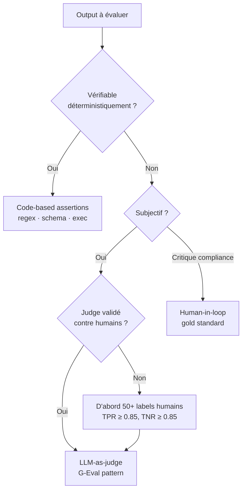

# Module 06 — Évaluations et observabilité (Avril 2026)

> *"60–80 % du temps de dev sur un vrai produit LLM est en error analysis + evals, pas en prompting."* — Hamel Husain.

## 1. Pourquoi les evals sont la compétence la plus sous-investie en 2026

Sans evals, vous n'avez pas de feedback loop fiable. Symptômes courants :

- *"Le nouveau modèle est meilleur"* sans baseline = vibe-driven.
- Régressions de prompts détectées par des users en prod, plusieurs jours après release.
- Pas de gating CI sur les changes de prompt → vous mergez à l'aveugle.
- Switching de modèle (cheap pour économiser) qui dégrade 20 % du trafic sans alerte.

Eval-driven development (EDD) est à 2026 ce que TDD était à 2010 : la pratique qui sépare les équipes qui shippent vite avec confiance de celles qui shippent vite et déstabilisent leur produit.

## 2. La séquence imposée (Hamel Husain)

> **Error analysis d'abord. Tout le reste après.**

1. **Lire 100+ traces.**
2. **Open-coding** : annotations free-text sur chaque trace (ce qui est cassé, pourquoi).
3. **Axial coding** : itérer pour faire émerger une taxonomie de failure modes.
4. **Saturation** : itérer jusqu'à ce que les nouvelles traces n'apportent plus de nouvelle catégorie.
5. **Décider quoi évaluer** sur la base de cette taxonomie.

> Skipper cette étape est *l'anti-pattern n° 1* qu'observe Hamel.

## 3. Hiérarchie des evals

```
1. Code-based assertions       (cheapest, le plus fiable, le premier)
2. LLM-as-judge                (subjective, après assertions, validé contre humains)
3. Human-in-loop               (expensive, gold standard, pour la calibration)
```



> **Toujours commencer par le haut.** Code-based d'abord — c'est cheap, déterministe, reproductible.

### 3.1 Code-based assertions

Regex, schema validation (Zod), exec de code généré, comparaison contre référence, propriétés invariantes.

```typescript
import { z } from "zod";

const expected = z.object({
  summary: z.string().min(50).max(500),
  citations: z.array(z.object({
    url: z.string().url(),
    quote: z.string(),
  })).min(1),
});

function evalSummary(output: unknown): { passed: boolean; reasons: string[] } {
  const result = expected.safeParse(output);
  if (!result.success) {
    return { passed: false, reasons: result.error.issues.map(i => i.message) };
  }
  // Property-based check
  const reasons: string[] = [];
  if (!result.data.summary.includes(".")) reasons.push("summary missing punctuation");
  if (result.data.citations.some(c => !c.url.startsWith("https://"))) {
    reasons.push("non-https citation");
  }
  return { passed: reasons.length === 0, reasons };
}
```

> **Toujours commencer ici**. C'est cheap, déterministe, reproducible.

### 3.2 LLM-as-judge

Pour les qualités subjectives (utilité, ton, accuracy quand une référence n'est pas pratique).

> **Règle absolue** : valider votre judge contre 50+ labels humains *avant* de lui faire confiance. Cible : TPR ≥ 0.85, TNR ≥ 0.85.

```typescript
import { generateObject } from "ai";
import { z } from "zod";

async function judgeFaithfulness(
  question: string,
  context: string,
  answer: string,
) {
  return await generateObject({
    model: "anthropic/claude-sonnet-4.5",
    schema: z.object({
      faithful: z.boolean(),
      reasoning: z.string(),
      unsupported_claims: z.array(z.string()),
    }),
    prompt: `Determine if the answer is supported by the context.

Question: ${question}
Context: ${context}
Answer: ${answer}

Be strict: any claim in the answer not in the context is unsupported.`,
  });
}
```

### 3.3 G-Eval pattern (Eugene Yan)

Chain-of-thought + form-filling. Connaître les biais à contrôler :

- **Position bias** : le judge préfère la réponse en position A (ou B). Mitigation : randomiser l'ordre, faire deux passes.
- **Verbosity bias** : préfère la réponse plus longue. Mitigation : normalize longueur ou pénaliser explicitement.
- **Self-enhancement bias** : le model préfère ses propres outputs. Mitigation : utiliser un judge d'une famille différente du model evalué.
- **Calibration faible** : gpt-3.5-turbo a > 95 % precision mais 30–60 % recall sur factual-consistency en summarization. Pour les guardrails prod high-throughput, **distillez le judge en classifier fine-tuné** ; les API judges sont trop lents et trop chers.

## 4. CI vs Production splits

| Dimension | CI/CD | Production |
|---|---|---|
| **Dataset** | 100+ queries curated, regression-focused | Sampling live de traces |
| **Evaluator** | Assertions déterministes | Reference-free LLM judges OK |
| **Latency budget** | Tight (block PR) | Async OK |
| **Failure threshold** | Strict (faithfulness < 0.85 = fail) | Alerte (drift signifiant) |
| **Frequency** | Chaque PR | Continu / sampling |

## 5. Outils d'eval (avril 2026)

### Promptfoo

Open-source, used by OpenAI et Anthropic en interne. Best pour les regression tests CI sur prompts.

```yaml
# promptfooconfig.yaml
prompts:
  - file://prompts/researcher.md
providers:
  - anthropic:claude-sonnet-4.5
tests:
  - vars:
      query: "What are the main features of Next.js 16?"
    assert:
      - type: contains
        value: "Cache Components"
      - type: llm-rubric
        value: "Mentions PPR, Turbopack, after()"
        threshold: 0.8
      - type: latency
        threshold: 5000
```

```bash
promptfoo eval
promptfoo view  # interface web pour comparer runs
```

### RAGAS

Spécifique RAG. Faithfulness / answer relevance / context precision / context recall (couverts dans le module 05).

### Braintrust

Eval platform commerciale (Perplexity, Airtable, Replit). **Le pitch** : evals comme gates dans les PR, statistical significance built-in.

```typescript
import { Eval } from "braintrust";

Eval("research-agent", {
  data: () => loadGoldenSet(),
  task: async ({ query }) => researchAgent.generate({ prompt: query }),
  scores: [
    Faithfulness,
    AnswerRelevance,
    {
      name: "has_citations",
      score: ({ output }) => output.citations.length > 0 ? 1 : 0,
    },
  ],
});
```

CI gate : Braintrust bloque les merges qui régressent sur le baseline.

### Langfuse

Open-source, self-hostable. Acquis par ClickHouse en janvier 2026. Strong observability + eval. Self-host coûteux ops (Postgres + ClickHouse + Redis + S3).

### Phoenix (Arize)

Le best OpenTelemetry-native. Strong open-source eval library.

### Décision sénior (avril 2026)

| Vous voulez… | Choisir |
|---|---|
| Regression tests CI sur prompts | **Promptfoo** |
| Eval-driven CI gates avec stat-significance | **Braintrust** |
| Observability + evals self-hostable | **Langfuse** |
| RAG-specific metrics | **RAGAS** |
| Lock-in LangChain | **LangSmith** |
| OpenTelemetry-first | **Phoenix** |

> **Setup commun en prod** : gateway (Helicone ou Portkey) pour cost/routing + eval tool (Braintrust ou Phoenix) pour quality.

## 6. Observabilité — OpenTelemetry GenAI

OpenTelemetry GenAI semantic conventions sont désormais table stakes. Loggez :

```typescript
// Spans GenAI (OpenTelemetry)
span.setAttributes({
  "gen_ai.system": "anthropic",
  "gen_ai.request.model": "claude-sonnet-4.5",
  "gen_ai.request.max_tokens": 4096,
  "gen_ai.request.temperature": 0.7,
  "gen_ai.response.id": response.id,
  "gen_ai.response.finish_reasons": [response.finishReason],
  "gen_ai.usage.input_tokens": response.usage.inputTokens,
  "gen_ai.usage.output_tokens": response.usage.outputTokens,
  "gen_ai.usage.cached_input_tokens": response.usage.cacheReadTokens,
  "gen_ai.completion.0.role": "assistant",
});
```

### Ce qu'il faut logger sur chaque appel

- Prompt template + variables (séparés — variables peuvent contenir PII).
- Completion full.
- Modèle + version.
- Tokens (prompt / completion / cached).
- Latence.
- Coût (calculé à partir tokens + prix model).
- Tool calls + responses.
- User / session / tenant.
- Eval scores quand disponibles.
- Parent span ID (pour reconstruire les multi-agent runs).

### Multi-agent tracing

Les trace IDs propagent à travers orchestrator → workers. Chaque worker est un span enfant. Vous pouvez visualiser un run multi-agent comme un waterfall trace dans n'importe quel APM.

```typescript
import { trace } from "@opentelemetry/api";

const tracer = trace.getTracer("agents");

async function orchestrate(query: string) {
  return tracer.startActiveSpan("orchestrator", async (parent) => {
    const plan = await sonnet.plan({ query });
    parent.setAttribute("plan.subtask_count", plan.subtasks.length);

    const results = await Promise.all(
      plan.subtasks.map((task, i) =>
        tracer.startActiveSpan(`worker-${i}`, async () => {
          return await haiku.run(task);
        })
      )
    );

    return await sonnet.synthesize(results);
  });
}
```

## 7. Eval-driven CI (gate en PR)

```yaml
# .github/workflows/evals.yml
name: Evals
on: pull_request
jobs:
  evals:
    runs-on: ubuntu-latest
    steps:
      - uses: actions/checkout@v4
      - uses: pnpm/action-setup@v3
      - run: pnpm install --frozen-lockfile
      - run: pnpm promptfoo eval --output evals/results.json
        env:
          ANTHROPIC_API_KEY: ${{ secrets.ANTHROPIC_API_KEY }}
      - run: pnpm tsx scripts/check-eval-thresholds.ts evals/results.json
      # Failed evals → exit non-zero → block merge
```

```typescript
// scripts/check-eval-thresholds.ts
import { readFileSync } from "node:fs";

const results = JSON.parse(readFileSync(process.argv[2], "utf-8"));
const thresholds = {
  faithfulness: 0.85,
  answer_relevance: 0.80,
  citation_coverage: 0.90,
};

let failed = false;
for (const [metric, threshold] of Object.entries(thresholds)) {
  const value = results.metrics[metric];
  if (value < threshold) {
    console.error(`FAIL: ${metric} = ${value} (threshold ${threshold})`);
    failed = true;
  }
}
process.exit(failed ? 1 : 0);
```

## 8. Eval pour les agents multi-step

Plus dur que pour les single-shot. Approches :

### Trajectory eval

Vérifier la séquence de tool calls + le final answer.

```typescript
const expected = {
  required_tools: ["decompose", "retrieve", "finalAnswer"],
  forbidden_tools: ["delete_file"],
  max_steps: 10,
};

function evalTrajectory(steps: Step[]): boolean {
  const tools = steps.flatMap(s => s.toolCalls).map(c => c.toolName);
  if (steps.length > expected.max_steps) return false;
  if (!expected.required_tools.every(t => tools.includes(t))) return false;
  if (expected.forbidden_tools.some(t => tools.includes(t))) return false;
  return true;
}
```

### Step-level eval

Eval chaque étape. Coûteux mais granulaire.

### Output eval seulement

Souvent suffisant. Si le final answer est bon, peu importe la trajectoire.

## 9. Red flags dans vos evals

- **100 % pass rate** : votre dataset n'est pas assez challenging. Cible ~70 %.
- **0 % pass rate** : votre threshold est wrong, ou votre dataset est cassé.
- **Pass rate qui monte sans changement de modèle** : data leakage (test set entré dans le training).
- **Variance massive entre runs** : sampling temperature trop haute, ou dataset trop petit.
- **Eval qui ne catch jamais de régressions** : le dataset ne couvre pas les failure modes réels.

## 10. Erreurs communes en eval

| Erreur | Symptôme | Mitigation |
|---|---|---|
| **Eval-as-prompt-engineering** | Edit le prompt jusqu'à passer | Hold-out un test set ; ne le regardez pas pendant l'iteration |
| **Judge non-validé** | False sense of security | 50+ labels humains avant de trust un judge |
| **Position bias** | Variance énorme entre runs | Randomize l'ordre, run 2× avec ordre swap |
| **Verbose-bias** | Judge favorise les réponses longues | Normalize longueur ou penalize explicitement |
| **Self-enhancement** | Sonnet judge favorise Sonnet | Utiliser un judge d'une autre famille (GPT, Gemini) |
| **No production eval** | Ship des regressions sans alerte | Sample 1% du trafic prod, run async eval |
| **Eval coverage mince** | Catch que la failure mode "happy path" | Étendre dataset à partir des failures réelles |

## 11. Workflow eval pour un sénior

1. **Avant tout dev** : 50–100 queries dans un golden set (avec answers attendus quand possible).
2. **Pendant le dev** : `promptfoo eval` après chaque change de prompt.
3. **En CI** : threshold-gates sur faithfulness / answer_relevance / coverage.
4. **En prod** : sampling de traces (1–5 %), eval async via Braintrust/Langfuse.
5. **Hebdo** : review des failures avec l'équipe ; étendre golden set.
6. **Mensuel** : full re-eval contre le baseline du mois précédent (catch les drifts cumulatifs).

## Ce qu'il faut emporter de ce module

1. **Eval-driven dev > prompt engineering**. La compétence rare en 2026.
2. **Error analysis sur 100+ traces avant tout**. C'est l'étape skippée par tout le monde.
3. **Code-based assertions d'abord**, LLM-as-judge ensuite (validé contre humains).
4. **Promptfoo en CI, Braintrust pour le gating**, Langfuse/Phoenix pour l'observabilité.
5. **OpenTelemetry GenAI semantic conventions** sont table stakes pour l'observabilité.
6. **Trace IDs cross-agent** pour reconstruire les multi-agent runs.
7. **CI gate sur thresholds** (faithfulness / relevance) bloque les régressions au PR.
8. **100 % pass = dataset trop facile, 0 % = bug**. Cible ~70 %.

Module suivant : [07-cout-securite-perf.md](./07-cout-securite-perf.md) — comment éviter de brûler 50 K$ par mois et de se prendre une prompt injection en prod.
