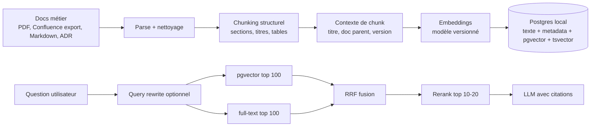
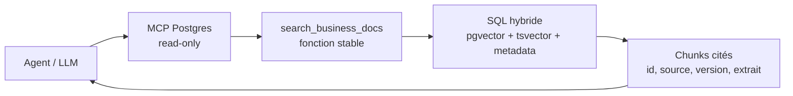

# Module 08 — RAG local sur PostgreSQL pour documentation métier (Avril 2026)

> Vectoriser la documentation métier dans un PostgreSQL local peut vraiment aider un LLM. Mais la partie qui marche n'est pas "mettre toute la doc en vecteurs". C'est un système de retrieval évalué, hybride, cite et maintenu.

## Verdict court

Oui, l'approche est solide pour une documentation métier interne, surtout si l'objectif est de réduire le contexte envoyé au modèle et de garder les réponses ancrees dans des sources locales. Le mecanisme est bien établi: le LLM ne mémorise pas la documentation, il demande à un outil de recherche de retrouver les passages pertinents, puis il répond avec ces passages en contexte.

Ce qui est prouve:

- Le papier fondateur [Retrieval-Augmented Generation for Knowledge-Intensive NLP Tasks](https://arxiv.org/abs/2005.11401) montre que combiner un modèle génératif avec une mémoire externe de passages retrouves améliore les tâches intensives en connaissance et produit des générations plus factuelles qu'un modèle paramétrique seul.
- Anthropic mesure sur plusieurs domaines que le RAG naïf perd des passages utiles, et que contextual retrieval + BM25 + rerank réduit le taux d'échec de retrieval top-20 de 5,7 % à 1,9 %, soit -67 % sur leur benchmark publié dans [Contextual Retrieval](https://www.anthropic.com/engineering/contextual-retrieval).
- Les travaux [Lost in the Middle](https://direct.mit.edu/tacl/article/doi/10.1162/tacl_a_00638/119630/Lost-in-the-Middle-How-Language-Models-Use-Long) montrent que les modèles utilisent mal certains elements enfouis dans de longs contextes. Retrieval cible + contexte court est donc souvent plus robuste que "coller toute la doc dans le prompt".
- `pgvector` fournit officiellement la recherche vectorielle dans Postgres, avec HNSW, IVFFlat, filtrage SQL, monitoring via `pg_stat_statements` et scaling Postgres classique. Voir le README [pgvector](https://github.com/pgvector/pgvector).

Ce qui n'est pas prouve universellement:

- Que le vector search seul bat toujours la recherche texte. Pour les noms de produits, codes, IDs, messages d'erreur et acronymes métier, le full-text search garde souvent l'avantage.
- Que Postgres est le bon store a toute échelle. Il est excellent pour demarrer localement et pour des corpus modestes a moyens; au-delà, il faut mesurer latence, recall, RAM, index build time et coût d'opérations.
- Que le système "comprend" la doc. Il retrouve des passages similaires; la compréhension vient ensuite du modèle, avec tous les risques de mauvaise synthèse si le contexte est incomplet.

## Pourquoi cette technique economise des tokens

Sans retrieval, l'option brute consiste a envoyer beaucoup de documentation dans chaque appel. C'est cher, lent et cognitivement bruyant pour le modèle.

Avec RAG local:

1. La documentation est decoupee en chunks.
2. Chaque chunk est transforme en embedding.
3. Les embeddings et le texte source sont stockes dans Postgres.
4. A chaque question, seule la query est embeddee.
5. Postgres retourne les 10 a 30 passages les plus probables.
6. Le LLM recoit uniquement ces passages, plus leurs metadonnees.

L'economie vient de la difference entre "envoyer 200 pages" et "envoyer 15 extraits pertinents". Le coût d'embedding initial est amorti, surtout si la documentation change moins souvent qu'elle n'est consultee.

## Pourquoi Postgres local est un bon choix senior

Postgres + `pgvector` est rarement le store le plus glamour, mais il a de tres bons attributs pour une entreprise qui veut commencer proprement:

- Les documents, chunks, metadonnees, droits, versions et embeddings peuvent vivre dans le même système transactionnel.
- Les filtres métier restent simples: produit, pays, BU, date, statut, type de document, confidentialité.
- La stack est opérable par des équipes qui savent déjà sauvegarder, monitorer et administrer Postgres.
- Le mode local réduit l'exposition des documents métier et permet de tester avec des embeddings open source si la politique data interdit un provider externe.
- La recherche hybride est naturelle: `tsvector` pour les termes exacts, `pgvector` pour la similarité sémantique, puis fusion de rangs.

Le guide Supabase [Hybrid search](https://supabase.com/docs/guides/ai/hybrid-search) documente bien ce pattern: recherche texte + recherche sémantique, fusion par Reciprocal Rank Fusion. Microsoft documente aussi les compromis d'indexation et de tuning dans [Optimize performance when using pgvector](https://learn.microsoft.com/en-us/azure/postgresql/extensions/how-to-optimize-performance-pgvector).

## Architecture recommandee



Le point important: le LLM ne "parcourt" pas vraiment la base comme un humain. Il appelle un outil de retrieval. L'outil doit donc être meilleur qu'un simple `ORDER BY embedding <=> query LIMIT 10`.

## Ou placer un MCP Postgres

Un serveur MCP Postgres est une bonne interface pour exposer cette base locale à un agent. MCP ne remplace pas le RAG: il standardise la facon dont l'agent appelle des outils externes. Dans ce cas, l'outil externe est Postgres.

La configuration de référence du repository Model Context Protocol montre un serveur Postgres lance avec `@modelcontextprotocol/server-postgres` et une URL locale, par exemple:

```json
{
  "mcpServers": {
    "postgres": {
      "command": "npx",
      "args": ["-y", "@modelcontextprotocol/server-postgres", "postgresql://localhost/mydb"]
    }
  }
}
```

Pour un RAG métier, je séparerais deux usages.

Premier usage: **MCP read-only pour inspection et debug**. L'agent peut regarder le schema, vérifier combien de chunks existent, inspecter une source, lancer une requête de diagnostic ou comparer vector-only vs full-text. C'est utile pour les seniors qui construisent et maintiennent le système.

Deuxieme usage: **tool de retrieval applicatif**. Au lieu de laisser l'agent ecrire n'importe quelle requête SQL, exposez une fonction stable comme `search_business_docs(query, filters, limit)`. Cette fonction encapsule semantic search, full-text, RRF, rerank eventuel et règles de droits. L'agent recoit des résultats structures, pas un accès libre a toute la base.

Le pattern preferable ressemble a ca:



Ce que je mettrais dans le contrat du tool:

```json
{
  "query": "Quelles exceptions s'appliquent aux remboursements B2B grands comptes ?",
  "filters": {
    "country": "FR",
    "document_type": "policy",
    "as_of": "2026-04-01"
  },
  "limit": 12
}
```

Et en sortie:

```json
{
  "results": [
    {
      "chunk_id": "uuid",
      "document_title": "Politique de remboursement B2B",
      "version": "2026-03",
      "source_uri": "confluence://...",
      "excerpt": "extrait court et cite",
      "scores": {
        "semantic_rank": 4,
        "lexical_rank": 1,
        "rrf": 0.031
      }
    }
  ]
}
```

La ligne rouge: ne donnez pas à l'agent un rôle Postgres capable d'ecrire, migrer ou supprimer dans la base documentaire de référence. Pour un RAG documentaire, `SELECT` suffit presque toujours. Si vous utilisez un serveur MCP plus puissant, comme certains MCP Prisma qui exposent migrations, creation de base ou exécution SQL, gardez cela pour les environnements de dev et exigez un consentement explicite sur les actions destructrices.

Le risque principal n'est pas seulement la suppression de données. C'est aussi l'exfiltration: un agent qui peut faire du SQL libre peut extraire plus de documentation que nécessaire et la remettre dans un prompt ou une réponse. Le bon design combine donc:

- utilisateur Postgres read-only;
- vues SQL limitees aux documents autorises;
- row-level security si les droits varient par équipe;
- fonctions de recherche avec `LIMIT` strict;
- logs des requêtes MCP;
- citations obligatoires;
- refus quand aucune source suffisante n'est trouvée.

En bref: MCP Postgres est une tres bonne prise pour brancher l'agent sur la base locale. Mais l'architecture senior consiste a exposer une capacité de retrieval, pas a transformer le LLM en DBA autonome.

## Schema Postgres minimal

```sql
CREATE EXTENSION IF NOT EXISTS vector;

CREATE TABLE business_documents (
  id uuid PRIMARY KEY,
  source_uri text NOT NULL,
  title text NOT NULL,
  document_type text NOT NULL,
  version text NOT NULL,
  updated_at timestamptz NOT NULL,
  content_hash text NOT NULL UNIQUE
);

CREATE TABLE business_chunks (
  id uuid PRIMARY KEY,
  document_id uuid NOT NULL REFERENCES business_documents(id),
  ordinal int NOT NULL,
  heading_path text[] NOT NULL,
  content text NOT NULL,
  contextual_label text NOT NULL,
  embedding_model text NOT NULL,
  embedding vector(1536) NOT NULL,
  search_text tsvector GENERATED ALWAYS AS (
    to_tsvector('french', contextual_label || ' ' || content)
  ) STORED
);

CREATE INDEX business_chunks_embedding_hnsw
  ON business_chunks USING hnsw (embedding vector_cosine_ops);

CREATE INDEX business_chunks_search_text_gin
  ON business_chunks USING gin(search_text);

CREATE INDEX business_chunks_document_id_idx
  ON business_chunks(document_id);
```

En production, creez les gros index apres le chargement initial, puis utilisez `CREATE INDEX CONCURRENTLY` pour éviter de bloquer les ecritures. Le README pgvector recommande aussi `EXPLAIN (ANALYZE, BUFFERS)` et `pg_stat_statements` pour comprendre les requêtes lentes.

## Les 6 décisions qui font la qualité

### 1. Chunker selon la structure métier

Le mauvais chunking coupe au nombre de tokens. Le bon chunking preserve les titres, tables, définitions, exceptions, scopes et références.

Pour une documentation métier, un chunk devrait souvent correspondre a:

- une règle métier complète;
- une section de processus;
- un cas d'exception;
- une ligne ou groupe logique de table;
- un ADR ou extrait decisionnel autonome.

Si un chunk dit "cette règle ne s'applique pas dans ce cas", mais que le "cas" est dans le chunk precedent, le retrieval echouera proprement mais la réponse sera fausse.

### 2. Ajouter du contexte au chunk

Anthropic montre que contextualiser chaque chunk avant indexation améliore fortement le retrieval. Dans une doc métier, le contexte peut être moins coûteux qu'un appel LLM par chunk:

```text
Document: Politique de remboursement B2B
Version: 2026-03
Section: Exceptions > Grands comptes > Contrats cadres
Pays: France
Résumé local: Conditions de remboursement pour clients B2B sous contrat cadre.
```

Ce prefixe doit être inclus dans l'embedding et dans le `tsvector`, mais le texte original doit rester disponible pour citation.

### 3. Faire de l'hybride, pas du vectoriel pur

La recherche vectorielle retrouve les formulations proches. La recherche texte retrouve les termes exacts. Une doc métier contient beaucoup de termes exacts: SKU, codes d'offre, noms de contrats, clauses, pays, acronymes, IDs d'incident.

Le baseline raisonnable est:

- top 100 semantic avec `pgvector`;
- top 100 lexical avec `tsvector`;
- fusion RRF;
- rerank top 20;
- top 8 a 15 passages dans le prompt final.

### 4. Versionner les embeddings

Un embedding n'est pas une verite stable. Il dépend du modèle, de la dimension, du nettoyage, du chunking et du contexte ajoute.

Stockez au minimum:

- `embedding_model`;
- `embedding_dimension`;
- `chunking_strategy_version`;
- `content_hash`;
- `indexed_at`;
- `source_updated_at`.

Sinon vous ne saurez pas comparer deux runs, reindexer proprement, ni expliquer pourquoi une question marchait la semaine derniere et plus aujourd'hui.

### 5. Citer les sources, pas seulement répondre

Une réponse RAG sans citations est une synthèse invérifiable. Pour un usage senior, l'interface ou le tool output doit renvoyer:

- `chunk_id`;
- titre du document;
- version/date;
- extrait exact court;
- score retrieval et score rerank si disponible;
- lien ou chemin vers la source.

Le LLM doit avoir une instruction dure: ne pas répondre si les passages ne supportent pas la conclusion.

### 6. Évaluer avec des questions métier réelles

La preuve locale ne vient pas d'un benchmark general. Elle vient d'un jeu de questions que vos seniors reconnaissent comme difficiles:

- questions avec vocabulaire informel;
- questions avec acronymes internes;
- questions multi-hop;
- questions ou la bonne réponse est "cela dépend";
- questions dont la réponse a change entre deux versions de doc;
- questions pieges ou la doc ne contient pas la réponse.

Mesurez au moins:

- recall@20: le bon passage est-il retrouve?
- context précision: les passages remontes sont-ils utiles?
- faithfulness: la réponse est-elle supportee par les sources?
- refusal quality: le système sait-il dire "je ne sais pas"?
- token budget: combien de tokens sont envoyes au modèle par question?
- p95 latency: retrieval + rerank + génération.

## Quand ça marche vraiment bien

Ce pattern est particulièrement utile quand:

- la documentation est plus grande que la fenêtre de contexte utile;
- les questions reviennent souvent;
- le corpus change, mais pas à chaque minute;
- les sources doivent rester locales ou auditables;
- l'équipe veut des citations et un chemin vers la source;
- les documents ont une structure métier stable;
- les utilisateurs posent des questions sémantiques, pas seulement des recherches exactes.

Exemples:

- règles d'eligibilite produit;
- politiques support, remboursement, pricing, compliance;
- documentation d'architecture interne;
- décisions ADR et RFC;
- playbooks d'incident;
- procédures d'exploitation;
- base de connaissance d'une équipe support L2/L3.

## Quand il vaut mieux éviter

Evitez de vendre ce système comme solution unique si:

- le corpus tient dans un contexte court et les questions sont rares;
- la source de verite est une base relationnelle qu'il faut interroger en SQL;
- la bonne réponse dépend d'un calcul, pas d'un passage documentaire;
- les droits documentaires sont complexes et non modelises;
- la doc est obsolette ou contradictoire;
- personne ne peut maintenir le pipeline d'indexation;
- l'équipe n'a pas de golden set pour évaluer.

Pour un codebase, soyez encore plus prudent: `grep`, symbol search, language servers et AST-aware search peuvent battre un RAG vectoriel. Le module 05 le rappelle: ne mettez pas "RAG partout" sans baseline.

## Checklist d'un pilote serieux

1. Choisir un corpus borné: 200 a 2 000 documents métier, pas "tout Confluence".
2. Nettoyer et dedupliquer les sources.
3. Définir une stratégie de chunking structurelle.
4. Stocker texte source, metadata, hash et version.
5. Implementer semantic + full-text + fusion.
6. Ajouter rerank si la précision est importante.
7. Construire 50 à 100 questions d'évaluation avec passages attendus.
8. Comparer trois baselines: recherche texte seule, vectoriel seul, hybride + rerank.
9. Mesurer tokens, latence, recall et qualité de citation.
10. Mettre une politique de reindexation incremental par hash.

## Conclusion senior

La technique dont tu as entendu parler est crédible. Elle est même l'un des patterns les plus durables du context engineering: garder la connaissance hors de la fenêtre de contexte, la retrouver juste a temps, puis donner au modèle un contexte court et sourcé.

Mais le mot clé n'est pas "vectoriser". Le mot clé est "retrouver". Si la base locale Postgres sert uniquement de sac de vecteurs, le gain sera fragile. Si elle devient un index métier versionné, hybride, évalué et cite, alors oui: elle peut réduire les tokens, améliorer la précision, faciliter l'audit et rendre les agents beaucoup plus utiles sur une documentation interne.

## Sources a lire

- [Retrieval-Augmented Generation for Knowledge-Intensive NLP Tasks](https://arxiv.org/abs/2005.11401), Lewis et al., NeurIPS 2020.
- [Contextual Retrieval](https://www.anthropic.com/engineering/contextual-retrieval), Anthropic, 2024.
- [Lost in the Middle: How Language Models Use Long Contexts](https://direct.mit.edu/tacl/article/doi/10.1162/tacl_a_00638/119630/Lost-in-the-Middle-How-Language-Models-Use-Long), Liu et al., TACL 2024.
- [pgvector README](https://github.com/pgvector/pgvector), extension Postgres pour recherche vectorielle.
- [Hybrid search](https://supabase.com/docs/guides/ai/hybrid-search), Supabase Docs.
- [Optimize performance when using pgvector](https://learn.microsoft.com/en-us/azure/postgresql/extensions/how-to-optimize-performance-pgvector), Microsoft Learn.
- [Retrieval API](https://platform.openai.com/docs/guides/retrieval), OpenAI Docs.
- [Model Context Protocol servers](https://github.com/modelcontextprotocol/servers), repository de référence MCP.
- [Prisma MCP server](https://www.prisma.io/docs/ai/tools/mcp-server), exemple de MCP Postgres avec garde-fous sur actions dangereuses.
