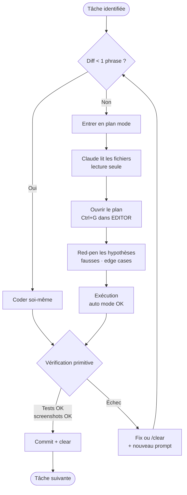

# Module 10 — Roadmap personnelle pour devenir top dev IA

> Vous savez déjà coder. Ce qu'il faut maintenant, c'est ré-architecturer votre process et vos compétences pour exploiter les agents. 6 mois est un horizon raisonnable pour atteindre un niveau staff/principal IA-native.

## 1. Les quatre métacompétences à développer

Rappel du module 00 :

1. **Décomposition du travail** — savoir quels morceaux sont self-contained.
2. **Context engineering** — gérer la fenêtre comme une ressource finie.
3. **Eval-driven dev** — instrumenter, mesurer, garder.
4. **System design pour agents** — repo, org, CI conçus pour les agents.

Tout le reste découle de ça.

## 2. Daily loop optimal

Votre journée standard, en avril 2026 :

### Avant le code

- `claude --resume` (ou `--continue`) pour reprendre la session de la veille.
- Vérifier les notifications des agents background (Cursor cloud, Trigger.dev runs nightly).
- Skim les PRs de CodeRabbit/Greptile sur les agents-PR ouverts overnight.

### Pour chaque tâche

### Anti-patterns à éviter

- **Kitchen sink session** : ne pas faire 5 tâches non liées dans la même session. Failures compoundent.
- **Pas de plan mode** sur des changes multi-fichiers : 90 % du temps perdu sur des patches IA.
- **Pas de verification primitive** : pas de tests, pas de screenshots — vous *êtes* la feedback loop unique.
- **Override permission de manière reflex** : un classifier auto mode catch les vraies escalations ; ne tapez pas "y" en autopilote.
- **Ne pas `/clear` entre tâches** : pollution context.

## 3. Quand coder vous-même vs déléguer

| Situation | Approche | Pourquoi |
|---|---|---|
| Bug fix descriptible en 1 phrase | Vous-même | L'overhead de plan + exécution dépasse le coût |
| Code crypto / auth / billing | Vous-même + tests intégration | Coût d'hallucination unacceptable |
| Performance work nécessitant intuition | Vous-même | Le model n'a pas votre contexte produit |
| Langage où vous battez le model | Vous-même | Faites confiance à votre expertise |
| Features 3+ fichiers | Plan mode + exécution | Sweet spot agent |
| Migrations | Plan mode + exécution | Le model est solide là-dessus |
| Backfill de tests | Plan mode + exécution + mutation gate | TAG |
| Refactors avec frontières claires | Plan mode + exécution | Idem |
| Migration large | Background agent / agent team | Survit à la fermeture du laptop |
| Refactor cross-cutting | Agent team avec hypothèses concurrentes | Adversarial debugging |
| PR review triage | Agent CI (CodeRabbit / Greptile) | Coverage |
| Investigation cross-services | Agent team | Décomposition |

## 4. Roadmap 6 mois (par mois)

### Mois 1 — Setup et workflow personnel

- Installer Claude Code, configurer `~/.claude/settings.json` avec hooks de base.
- Configurer Cursor (ou Cursor 3) en parallèle.
- Construire votre premier `AGENTS.md` sur votre repo le plus actif.
- Migrer toutes vos `.cursorrules` / `CLAUDE.md` vers `AGENTS.md` unique.
- Adopter plan mode systématiquement sur les PRs multi-fichiers.
- **Cible mois 1** : 50 % de vos PRs passent par plan mode + agent ; vous mesurez le delta de qualité (PRs reviewées, bugs trouvés).

### Mois 2 — Choix d'outils et cas d'usage reels

- Comparer Codex, Claude Code, Cursor, Copilot coding agent et un outil local/open source sur le meme vrai ticket.
- Construire une matrice de cas d'usage : comprehension de code, refactor, migration, tests, review, docs, investigation incident.
- Standardiser les criteres de choix : securite, droits, audit trail, integration Git, cout, latence, qualite de review.
- Documenter les conditions d'usage dans `AGENTS.md` ou une doc d'equipe agnostique.
- **Cible mois 2** : vous avez 3 cas d'usage repetables, mesures et expliques a l'equipe.

### Mois 3 — Evals et observabilité

- Construire un golden dataset de 100 queries pour votre feature IA.
- Setup Promptfoo en CI ; gate sur faithfulness + relevance.
- Brancher Langfuse ou Braintrust pour l'observabilité prod.
- Pratiquer error analysis : 100+ traces lues, taxonomy de failures construite.
- **Cible mois 3** : régressions de prompts catchées en CI avant merge.

### Mois 4 — RAG et multi-agents

- Construire un RAG avec contextual retrieval + hybrid + rerank.
- Comparer perf vs naïf (mesurer faithfulness gain).
- Implémenter un agent orchestrator-worker (Anthropic style) sur un cas réel.
- Pratiquer la décomposition : quels jobs en workers ? quelles boundaries ?
- **Cible mois 4** : un système multi-agent en prod avec eval-gate.

### Mois 5 — Background, real-time, voice

- Setup Trigger.dev v3 ou Inngest, migrer un job long-running.
- Si applicable au produit : prototyper un agent voice (OpenAI Realtime + WebRTC).
- Resumable streams sur tous les chats sérieux.
- **Cible mois 5** : vos agents survivent crashes/deploys ; vous savez construire du voice sub-300 ms si nécessaire.

### Mois 6 — System design et leadership

- Écrire un AGENTS.md, une skill, et un subagent pour l'org (pas juste pour vous).
- Mentor sur plan mode, hooks, evals.
- Construire un MCP interne pour votre boite (codebase context, ticketing, etc.).
- Lire les blogs eng Anthropic / Vercel / Cursor en continue ; maintenir une veille active.
- **Cible mois 6** : vous êtes la personne dans l'équipe qui sait répondre aux questions IA-architecture ; les juniors viennent vous voir pour designer leurs systèmes IA.

## 5. Métriques personnelles à tracker

### Vélocité

- **PRs / semaine** : le baseline avant adoption agent vs après.
- **Time-to-first-PR** sur une feature : de la spec au premier draft mergeable.
- **Time-to-debug** : de la report d'un bug à la fix mergée.

### Qualité

- **Bugs reportés / 100 PRs** : doit *baisser* avec adoption agent + verification.
- **Régressions de prompt** : doit être 0 en prod si vous avez les eval gates.
- **Coverage AI features** : combien de votre code IA est sous test/eval ?

### Cost (si vous owner du budget)

- **$ / feature** : pour les features lourdes IA, monitorer le coût par user / feature.
- **Cache hit rate** sur prefix prompts : target > 50 %.
- **Ratio Haiku / Sonnet / Opus** : si tout part au Sonnet, vous ratez le levier routing.

### Vous personnellement

- **% de PRs passant par plan mode** sur les multi-fichiers.
- **% de PRs avec eval gate** quand applicable.
- **Heures / semaine en supervision agent** vs en code direct.
- **Heures / semaine sur veille technique** (blogs, papers, talks).

## 6. Veille — sources à suivre actives

### Blogs eng

- **Anthropic Engineering** : https://www.anthropic.com/engineering — la référence sur agents, context engineering, skills.
- **Vercel Blog** : https://vercel.com/blog — Next.js, AI SDK, plateforme.
- **Cursor Blog** : https://cursor.com/blog — patterns IDE-first, scale agents.
- **OpenAI Blog (engineering)** : posts techniques, releases.
- **Google AI Blog** : Gemini, search.

### Podcasts

- **Latent Space** (swyx) — le podcast de référence sur l'AI engineering.
- **The Pragmatic Engineer** — interviews staff/principal eng sur les pratiques internes.

### Newsletters

- **AI News** (smol.ai)
- **The Latent Space**
- **The Pragmatic Engineer**
- **The Information** (paywall, mais signal/noise élevé sur l'industrie)

### Communautés

- **AI Engineer Summit** (annuel + Europe edition).
- Discord OpenAI, Anthropic, Vercel.
- GitHub : suivre les release notes de `vercel/ai`, `vercel/next.js`, `anthropics/claude-agent-sdk`, `openai/openai-agents-js`.

### À éviter

- LinkedIn AI thought leaders.
- YouTube influencers vibe-coding.
- Twitter threads "10 things every AI dev needs" (sauf swyx, ethan mollick, simon willison).

## 7. Patterns d'apprentissage

### Read once, apply ten times

Lire passivement n'a presque pas d'effet. Convertissez chaque article eng pertinent en 1 application concrete dans votre code.

### Build it twice

La première fois, vous découvrez la complexité. La deuxième fois, vous shipez du clean. Ne vous attachez pas trop à la version 1.

### Mesurer, toujours

Si vous changez de modèle, vous devez avoir une baseline d'évals. Si vous ajoutez du caching, vous devez mesurer le cache hit rate. Si vous adoptez plan mode, vous devez mesurer le delta qualité PR. La perception est trompeuse.

### Lire les failures plus que les successes

Les success stories en blog post sont choisies. Les post-mortems et les traces d'échec d'agent enseignent plus.

## 8. Ce qu'il faut désapprendre

- **TDD strict avant code** : la TAG (tests after generation) avec mutation gate est devenue le bon pattern pour les agents.
- **Comments comme documentation** : votre AGENTS.md / skills sont la doc ; le code se documente avec des noms et types.
- **Préférer le simple au scalable** : avec les agents, "scalable" est *parfois* plus simple à shippé qu'un quick hack qui devra être migré.
- **Tout coder soi-même par fierté** : vous êtes payé pour ship value, pas pour taper des touches.
- **Ne pas mesurer parce que "ça marche"** : sans evals, vos régressions arrivent en prod.

## 9. Pièges à éviter

| Piège | Symptôme | Évitement |
|---|---|---|
| **Adopter sans mesurer** | "Je code 10× plus vite" sans métriques | Tracker les vraies métriques |
| **Trust the model on everything** | Agents qui shipent du code crypto/auth bogué | Garder le human-in-loop sur les paths critiques |
| **AGENTS.md trop long** | Agents performent moins bien | Capper à 80 lignes ; pousser le reste en skills |
| **Skill pour tout** | Maintenance débile | Skills seulement pour la knowledge non-default |
| **Multi-agent before workflows** | Coût ×15 sans bénéfice | Workflow primitives d'abord |
| **RAG on everything** | Stale, bruité, lent | Mesurer vs glob/grep avant d'adopter |
| **No eval, switch model** | Régressions invisibles en prod | Baseline avant tout switch |
| **Trop de modèles différents** | Maintenance prompts cassée | Standardize 2–3 modèles max |
| **Custom MCP au lieu de tools** | Type safety perdue | Tools in-process > MCP sauf si user-owned |

## 10. Le but final

> *"La compétence rare en 2024 était de prompter. La compétence rare en 2026 est le system design pour agents."*

À 6 mois, vous devriez :

- **Lire un AGENTS.md d'un nouveau repo et savoir s'il est bon ou cassé.**
- **Diagnostiquer un système IA en prod** : pourquoi cette latence p99, pourquoi ces régressions, pourquoi cette facture.
- **Designer un système multi-agent** en sachant *quand ne pas l'utiliser*.
- **Pricer un projet IA** : tokens, infra, observabilité, eval team.
- **Mentorer** des juniors sur plan mode, hooks, evals, sans citer cette formation.
- **Écrire des skills et des subagents** réutilisables pour votre org.
- **Construire un MCP** quand le besoin émerge.
- **Auditer la sécurité** d'un endpoint LLM (input filter, trust boundary, output guard, rate limit).

C'est le profil staff/principal IA-native que les boites top tech recrutent en 2026.

## 11. Ressources finales pour aller plus loin

La bibliographie vivante est maintenue directement dans les ressources de l'observatoire et dans `lib/resources.ts`.

Trois lectures uniques à faire dans la semaine pour calibrer votre direction :

1. **Anthropic — Building Effective Agents** (https://www.anthropic.com/engineering/building-effective-agents) — la taxonomie workflow vs agent.
2. **Anthropic — Effective Context Engineering for AI Agents** — pourquoi context > prompt.
3. **Hamel Husain — LLM Evals FAQ** (https://hamel.dev/blog/posts/evals-faq/) — pourquoi 60–80 % de votre temps va en evals.

## Ce qu'il faut emporter de ce module

1. **6 mois est un horizon raisonnable** pour devenir un staff/principal IA-native.
2. **Daily loop = plan mode → exec → verify → /clear** ; ne dérogez pas.
3. **Mesurez tout** : sans baseline, vous vivez dans l'illusion.
4. **Le but n'est pas de coder plus vite** ; c'est de *décomposer mieux* et *mesurer mieux*.
5. **Les blogs eng Anthropic / Vercel / Cursor sont le canon** ; tout le reste est secondaire.

Vous avez la formation. La suite est entre vos mains.
