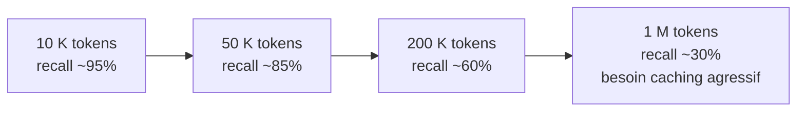
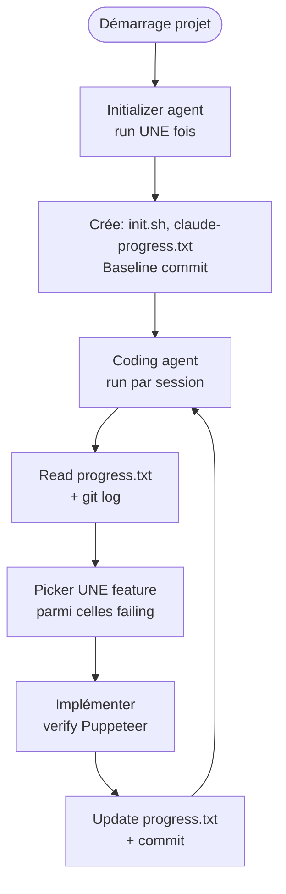
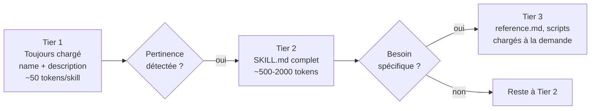

# Module 11 — Context Engineering (Avril 2026)

> *« La compétence rare en 2024 était de prompter. La compétence rare en 2026 est le context engineering — gérer la fenêtre de contexte comme une ressource finie. »*

Le prompt engineering est devenu commodity. Le context engineering est ce qui sépare les apps IA qui scalent de celles qui cassent à 50 turns ou à 100 K tokens. Ce module est l'approfondissement le plus important de la formation.

## 1. Le changement de paradigme

| Prompt engineering (2023–24) | Context engineering (2025–26) |
|---|---|
| « Comment formuler le prompt parfait » | « Quoi mettre dans la fenêtre, quoi en retirer, quand » |
| Single-turn optimization | Multi-turn, multi-agent, long-horizon |
| Few-shot examples in prompt | Skills + tools + memory externes |
| Static system prompt | Dynamique : initializer agent, compaction, sub-agent isolation |
| Token cost ignored | Token cost central (stack 5–10× chez Anthropic) |
| Prompt = tout le contexte | Prompt = un fragment ; le harness gère le reste |

Anthropic l'a explicit dans *Effective Context Engineering for AI Agents* (2025) : **le contexte est une ressource finie avec rendements décroissants**. Au-delà d'un certain seuil de tokens, le recall *dégrade sub-linéairement* à cause de la complexité n² de l'attention.

## 2. Context rot — pourquoi plus n'est pas mieux

Le phénomène mesuré : à mesure que le contexte croît, la précision sur les détails enfouis dégrade. C'est le **context rot**.



Conséquences pratiques :

- **« Lost in the middle »** : ce qu'on met au milieu d'un long contexte est moins bien retrouvé que ce qui est au début ou à la fin.
- **Attention dilution** : les vieux outputs de tools en milieu de transcript polluent.
- **Coût n²** : la latence et le coût montent quadratiquement avec la longueur du contexte effectif.
- **Decision drift** : sur des conversations > 30 turns, le modèle « oublie » des décisions architecturales prises au début.

## 3. Les patterns canoniques (Anthropic)

### 3.1 Just-in-time retrieval

L'agent garde des **références légères** (paths, IDs, signatures) ; il charge le contenu complet via tools (`grep`, `head`, `Read`) seulement quand pertinent.

```typescript
// Mauvais : on charge 50 fichiers preventivement
context: `${file1Content}\n${file2Content}\n${file3Content}\n…`

// Bon : on liste les paths, l'agent décide quoi lire
context: `Files in src/:
- src/auth/session.ts (180 LOC, Session class)
- src/auth/oauth.ts (240 LOC, OAuth flow)
- src/db/users.ts (120 LOC)`
```

C'est exactement comment Claude Code fonctionne sur les codebases : pas de RAG préchargé, juste glob/grep + raisonnement à la demande. Boris Cherny l'a dit explicitement : *« On a essayé RAG sur notre codebase. glob + grep + raisonnement bat. »*

### 3.2 Compaction périodique

À des checkpoints long-horizon, **summarize** les décisions architecturales et les questions non résolues ; **discard** les outputs de tools redondants ; ne garder que les ~5 fichiers les plus récemment accédés.

```typescript
// Pseudocode dans une boucle agent long-running
if (turnCount > 20 || tokenCount > 100_000) {
  const summary = await generateText({
    model: "anthropic/claude-sonnet-4.5",
    prompt: `Summarize this conversation, preserving:
- Architectural decisions made (with rationale)
- Unresolved questions and open hypotheses
- Most recent file reads (top 5 paths only)
- Active task and what remains

Discard:
- Verbose tool outputs that are no longer relevant
- Redundant intermediate reasoning

Conversation: ${JSON.stringify(messages)}`,
  });
  messages = [systemPrompt, { role: "user", content: summary.text }];
}
```

> **Trade-off** : la compaction peut perdre du contexte critique. Mitigation : compactez toujours via summarization (pas truncation), et persistez une *version raw* en logs externes pour debug.

### 3.3 Structured note-taking — le memory tool

Fichiers persistants (`progress.txt`, `decisions.md`, `architecture.md`) **hors contexte** ; reload **sur demande** avec un tool dédié.

Anthropic a shippé un **memory tool** natif pour ça — un kvstore que l'agent peut écrire/lire entre turns, sans tout reloader en contexte.

```typescript
// Pattern : checkpoint d'état architecturale
await tools.memory.write({
  key: "architecture-decisions",
  content: `
ADR-001: Chose Drizzle over Prisma (perf, type safety)
ADR-002: pgvector for embeddings (< 50M, transactional)
ADR-003: Auth via BetterAuth + WorkOS (SSO/SCIM)
`,
});

// Plus tard, dans une autre session :
const decisions = await tools.memory.read({ key: "architecture-decisions" });
// Le contexte contient juste cette string ciblée, pas tout l'historique
```

Pattern Anthropic *Effective Harnesses* : un fichier `claude-progress.txt` mis à jour par l'agent à chaque session, qui contient :

- Liste des features avec leur status (200+ items, marked `failing` jusqu'à vérification end-to-end avec Puppeteer).
- Décisions architecturales avec rationale.
- Questions ouvertes.
- Liens vers les fichiers récemment touchés.

Au début de chaque session, l'agent **lit `claude-progress.txt`** au lieu de reloader tout l'historique.

### 3.4 Sub-agent isolation

Déléguer à un subagent avec une **window propre** ; le subagent retourne un **summary 1–2 K tokens** au lieu du transcript raw.

```typescript
// Lead agent
const subResult = await Task.spawn({
  type: "research-subagent",
  prompt: "Investigate how token refresh is handled in our auth code",
  // Contexte propre du sous-agent
  // Le lead n'aura jamais à voir les fichiers lus, juste le résultat
});
// subResult = { summary: "Token refresh uses sliding window; bug at line 142...", refs: [...] }
```

> Sans cela, un research multi-fichiers polluerait le main context avec 50 file reads que le lead n'a pas besoin de voir.

C'est ce que Claude Code fait avec les `subagents` (`Explore`, `Plan`, custom). Et ce qu'Anthropic décrit dans *Multi-Agent Research System* : 15× tokens utilisés mais avec des **windows isolées par worker**, donc chaque worker reste sous le seuil de context rot.

## 4. Le harness Anthropic long-running (le pattern de référence)

Article *Effective harnesses for long-running agents* (2026) — deux agents spécialisés :



Trois choses cruciales :

1. **L'initializer ne run qu'une fois** : il met en place les fichiers de progress, le format des sessions futures, le baseline.
2. **La coding agent ne tient JAMAIS toute l'histoire en contexte** : elle lit `progress.txt` + `git log` (5–10 K tokens), pas le transcript des 50 sessions précédentes.
3. **Verification Puppeteer empêche le « premature done »** : un test end-to-end automatisé valide que la feature marche *avant* qu'elle soit marquée `passing`.

Résultat : un agent peut tourner sur des **centaines de features** sans jamais déborder son contexte, parce que l'état est persisté dans des fichiers externes lisibles à la demande.

## 5. Skills — progressive disclosure 3-tier

Cf. module 03 §1.2. Récap dans le contexte engineering :



C'est *l'inverse* de mettre tout dans CLAUDE.md. Anthropic en utilise des **centaines en interne** ; Claude Code en a une cinquantaine par défaut + les vôtres.

**Calcul d'économie** : 100 skills × 50 tokens = 5 K tokens always-on (tier 1). À comparer avec la même connaissance dans CLAUDE.md = ~50 K tokens always-on. **Gain : 90 % de tokens always-on**.

### Quand créer une skill

- ✅ Knowledge domain-specific (Stripe webhooks, OAuth flows, votre business rules).
- ✅ Code patterns spécialisés (templates, scripts générateurs).
- ✅ Workflows multi-étapes (« quand un user demande X, suivre la procédure Y »).
- ❌ Tout ce qui doit être *enforced* (utilisez des hooks à la place — les skills sont advisory).
- ❌ Conventions générales du projet (mettez-les dans AGENTS.md, court).

## 6. Tool descriptions — instructions, pas docs

Anthropic *Writing effective tools for AI agents* : **traitez les descriptions de tools comme des instructions pour un nouvel embauché**, pas comme de la documentation API.

```typescript
// ❌ Description plate, peu utile pour l'agent
const search = tool({
  name: "search",
  description: "Search the database",
  inputSchema: z.object({ q: z.string() }),
});

// ✅ Description qui guide la décision et l'usage
const search = tool({
  name: "searchProducts",
  description: `Search the products database by name, SKU, or description.

Use this when the user mentions a product by name or asks about catalog.
DO NOT use for orders or invoices — those have separate tools.

Returns up to 20 matches sorted by relevance. For pagination, use the
\`cursor\` parameter from the previous response.

Examples:
- "Show me running shoes" → searchProducts({ q: "running shoes" })
- "SKU 12345" → searchProducts({ q: "12345", field: "sku" })`,
  inputSchema: z.object({
    q: z.string().describe("Search query, minimum 2 chars"),
    field: z.enum(["name", "sku", "description"]).optional(),
    cursor: z.string().optional().describe("Pagination cursor from previous response"),
  }),
});
```

Discipline d'Anthropic :

- **Consolider les workflows multi-step** : `schedule_event` plutôt que `list_users` + `list_events` + `create_event`.
- **Préfixes de namespace** pour éviter les collisions (`stripe_create_invoice`, pas `create`).
- **Identifiants sémantiques** (`order-A23F`) plutôt que UUID (`5f3a-…`) — les UUID causent des hallucinations.
- **Pagination avec erreurs explicites** (« max 100 items per call »).
- **Inclure des examples** dans la description quand le format est non-trivial.

### Tool Search Tool (beta avancé)

Quand vous avez 50+ tools enregistrés, le simple fait de les exposer en system prompt coûte des milliers de tokens. Le **Tool Search Tool** d'Anthropic permet à l'agent de chercher dynamiquement parmi les tools selon la tâche, sans tous les avoir in-context.

Mesures Anthropic : Opus 4.5 a fait **79.5 % → 88.1 %** sur multi-tool tasks ; coupe **~55 K tokens** de tool defs inutilisées.

À adopter dès que vous dépassez ~30 tools.

## 7. Le pattern d'initialisation par tâche

Pour les agents non-trivial, **ne démarrez pas tabula rasa** à chaque tâche. Un mini-init phase avant l'exécution :

```typescript
async function runAgentTask(task: string) {
  // 1. Init phase (cheap, Haiku)
  const ctx = await haiku.run({
    instructions: `Read these files and return a brief context summary:
- progress.md (project state)
- AGENTS.md (conventions)
- relevant files based on the task

Return: { decisions: [], conventions: [], relevantFiles: [] }`,
    tools: { read, glob, grep },
    task,
  });

  // 2. Exec phase (Sonnet, focused context)
  const result = await sonnet.run({
    instructions: `Project context:
${JSON.stringify(ctx, null, 2)}

Task: ${task}

Use the relevant files above. Don't re-read AGENTS.md or progress.md.`,
    tools: { ...allTools },
  });

  // 3. Update progress
  await tools.memory.append("progress.md", `[${new Date().toISOString()}] ${task} → done`);

  return result;
}
```

Bénéfices :

- **Sonnet ne perd pas de tokens** à recharger AGENTS.md/progress.md ; Haiku le fait à 1/10 du prix.
- **Le contexte initial est ciblé** sur la tâche — Haiku a fait le tri.
- **L'historique est persisté en fichier**, pas en window.

## 8. Mesurer le context engineering

Sans mesure, vous optimisez à l'aveugle. Ce qu'il faut tracker :

| Métrique | Cible 2026 | Comment mesurer |
|---|---|---|
| **Tokens always-on** (system prompt + tool defs) | < 5 K | OpenTelemetry GenAI input_tokens sur 1er turn |
| **Token utilization ratio** | input/output > 5 | Logs Gateway |
| **Cache hit rate** | > 50 % sur prefix | Anthropic `cache_read_input_tokens` |
| **Average context size par turn** | Stable (pas de croissance n²) | Trace tokens par turn |
| **Recall sur queries needle-in-haystack** | > 90 % à 50 K tokens | Eval dédiée avec faits enfouis |
| **Decision drift** | 0 sur 30 turns | Eval qui re-vérifie les décisions architecturales en fin de session |

```typescript
// Eval simple de needle-in-haystack
async function evalRecall(model: string, contextSize: number) {
  const haystack = generateRandomText(contextSize);
  const needle = "The secret password is BANANA-42-X";
  const insertAt = Math.floor(haystack.length * 0.6); // milieu
  const polluted = haystack.slice(0, insertAt) + needle + haystack.slice(insertAt);

  const r = await generateText({
    model,
    prompt: `${polluted}\n\nQuestion: What is the secret password?`,
  });

  return r.text.includes("BANANA-42-X");
}
```

Run cette eval sur 100 samples par taille (10 K, 50 K, 200 K). Vous verrez la dégradation. Ajustez votre stratégie de compaction selon le seuil.

## 9. Anti-patterns du context engineering

| Anti-pattern | Symptôme | Mitigation |
|---|---|---|
| **CLAUDE.md de 500+ lignes** | Tokens always-on > 20 K, perfs dégradent | Cap à 80 lignes, pousser dans skills |
| **Tout précharger « au cas où »** | Token cost ×3, decision drift à 20 turns | Just-in-time retrieval |
| **Pas de compaction sur conversations longues** | Le modèle « oublie » les premières décisions | Trigger compaction à 100 K tokens |
| **Sub-agent qui retourne le transcript raw** | Lead context pollué | Forcer un summary structuré (Zod schema) |
| **Tool descriptions plates** | Mauvaise sélection de tool | Description = instructions pour nouvel embauché |
| **50+ tools always-loaded** | 30 K tokens always-on | Tool Search Tool ou groupes scoped |
| **Skills jamais utilisées** | Pollution de tier 1 | Audit régulier — supprimer celles non-déclenchées en 30 jours |
| **Pas de memory persistante** | Re-explore les mêmes fichiers chaque session | Memory tool ou progress.md |
| **Context monolithique** | Une session = un blob | Découper par sub-agent / par phase / par feature |

## 10. Workflow concret pour un sénior

### Pendant le dev d'une nouvelle feature IA

1. **Audit AGENTS.md** : > 80 lignes ? Pousser dans skills.
2. **Lister les tools** : > 30 ? Considérer Tool Search Tool ou scoping.
3. **Estimer tokens always-on** : run un dry test avec un prompt vide, regarder les input tokens. Si > 10 K, optimiser.
4. **Ajouter une eval needle-in-haystack** sur la taille de contexte typique de votre app.
5. **Setup compaction trigger** sur les agents longs (> 20 turns ou > 100 K tokens).
6. **Persister l'état architectural** dans memory tool ou fichier — pas dans le transcript.

### En review de code IA

Questions à poser systématiquement :

- Le system prompt est-il *stable* (cacheable) ?
- Les tool defs sont-elles séparées du contenu variable (pour caching) ?
- Y a-t-il une stratégie de compaction si la conversation s'allonge ?
- Les sub-agents retournent-ils des summaries structurés ou du raw ?
- Les fichiers persistents (progress, memory) sont-ils utilisés ou tout passe par le contexte ?

### Onboarding d'un nouveau dev IA dans l'équipe

Faire lire dans cet ordre :

1. AGENTS.md du repo.
2. Anthropic *Effective Context Engineering for AI Agents*.
3. Anthropic *Equipping Agents for the Real World with Skills*.
4. Anthropic *Effective Harnesses for Long-Running Agents*.
5. Ce module.

Puis : leur demander d'identifier 3 endroits dans votre codebase où le context engineering peut être amélioré.

## 11. Cas pratique : agent de support client avec contexte long

Avant context engineering :

```typescript
// ❌ Naïf — tout en contexte
const result = await streamText({
  model: "sonnet",
  system: HUGE_SYSTEM_PROMPT,           // 8 K tokens
  messages: allConversationHistory,      // grossit chaque turn (50 K+ après 30 turns)
  tools: ALL_FIFTY_TOOLS,                // 30 K tokens de tool defs
});
// Total always-on: ~38 K tokens. Conversation à 30 turns: ~90 K tokens.
// Coût ×3, latence ×2, recall qui dégrade.
```

Après context engineering :

```typescript
// ✅ Engineered
const result = await streamText({
  model: "sonnet",
  system: [
    { type: "text", text: COMPACT_SYSTEM, cache_control: { type: "ephemeral" } },  // 1 K
    { type: "text", text: TOOL_SEARCH_PROMPT, cache_control: { type: "ephemeral" } }, // 0.5 K
  ],
  messages: [
    { role: "system", content: await loadProgress(conversationId) },  // 2 K, mis à jour à chaque turn
    ...messagesAfterCompaction(allHistory),  // ~10 K, summarized si > 20 turns
  ],
  tools: { searchTool: toolSearchTool },     // 1 outil seul ; agent search dans le registre
});
// Always-on: ~5 K. Conversation: ~12 K stable. Coût /3, latence /2, recall stable.
```

Différence : **mêmes capacités, ~7× moins de tokens, recall stable même à 50 turns**.

## Ce qu'il faut emporter de ce module

1. **Le contexte est une ressource finie.** L'attention est n², le recall dégrade sub-linéairement.
2. **Les 4 patterns canoniques** : just-in-time retrieval, compaction, structured note-taking, sub-agent isolation.
3. **Skills + memory tool > CLAUDE.md monolithique.** Progressive disclosure 3-tier économise 90 % des tokens always-on.
4. **Tool descriptions = instructions** pour nouvel embauché, pas docs API.
5. **Mesurer** : tokens always-on, cache hit rate, recall needle-in-haystack, decision drift. Sans mesure, vous optimisez à l'aveugle.
6. **Le harness Anthropic** (initializer + coding agent + Puppeteer verification) est le pattern de référence pour les agents long-running.
7. **À 30+ tools, Tool Search Tool**. À 100+ skills, audit régulier.
8. La compétence rare en 2026, c'est ça. Investissez le temps.

## Visualisation

Le diagramme [Cycle de vie du contexte](/diagrammes#context-lifecycle) montre comment le contexte est managé tout au long d'un agent run : initialisation → exécution → compaction → sub-agents → persistence externe.

## Sources

- Anthropic — [Effective Context Engineering for AI Agents](https://www.anthropic.com/engineering/effective-context-engineering-for-ai-agents)
- Anthropic — [Effective Harnesses for Long-Running Agents](https://www.anthropic.com/engineering/effective-harnesses-for-long-running-agents)
- Anthropic — [Equipping Agents for the Real World with Agent Skills](https://www.anthropic.com/engineering/equipping-agents-for-the-real-world-with-agent-skills)
- Anthropic — [Writing effective tools for AI agents](https://www.anthropic.com/engineering/writing-tools-for-agents)
- Anthropic — [Advanced tool use](https://www.anthropic.com/engineering/advanced-tool-use)
- *Lost in the Middle: How Language Models Use Long Contexts* (Liu et al., Stanford)
