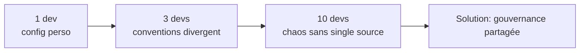
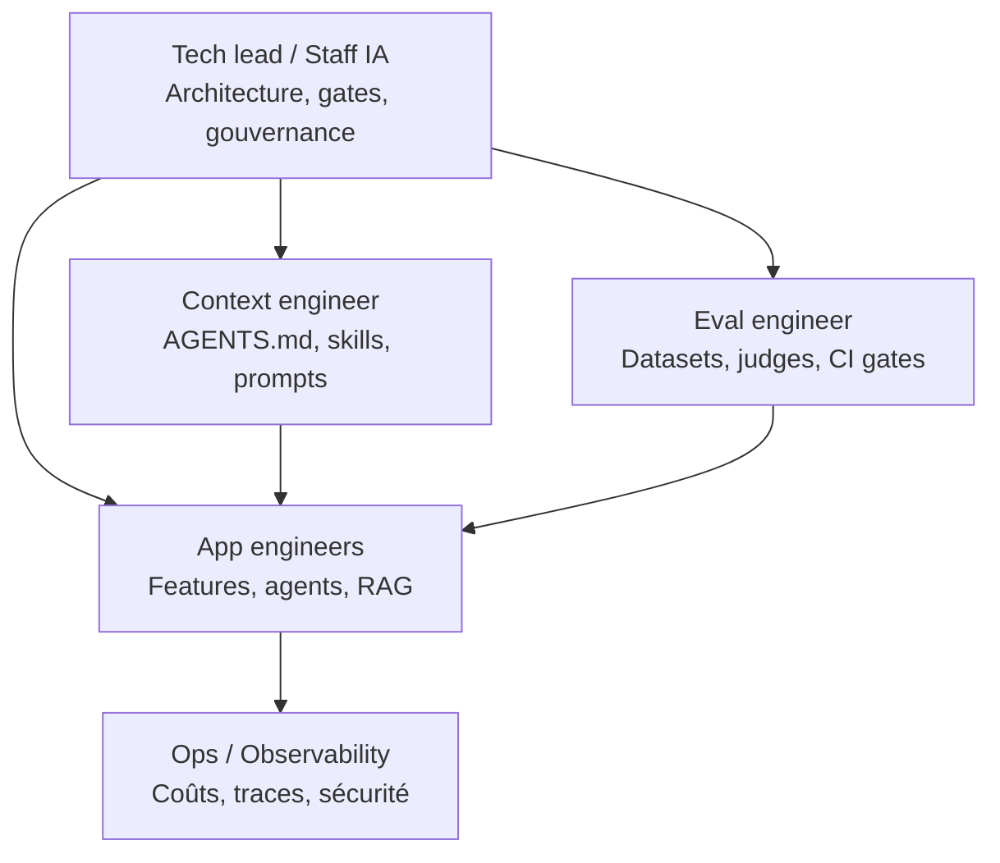
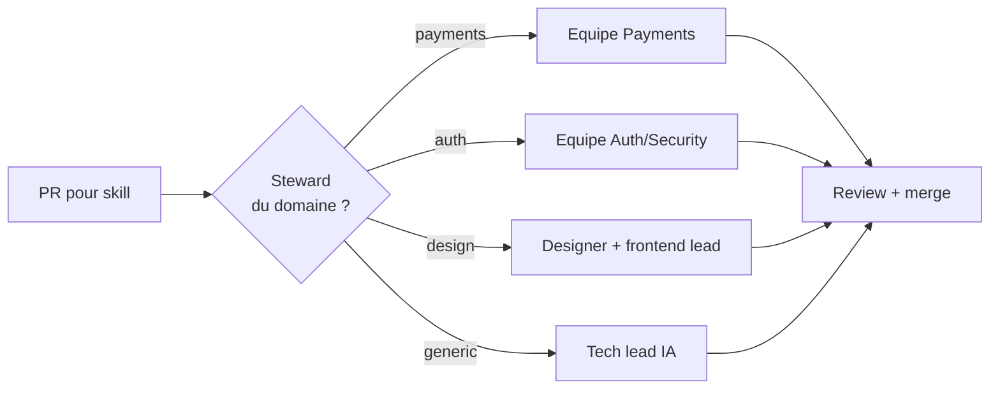
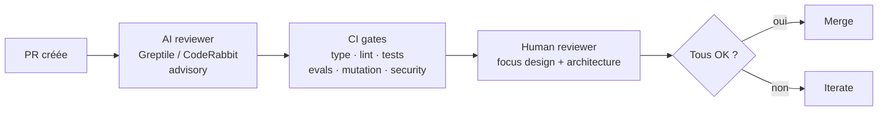
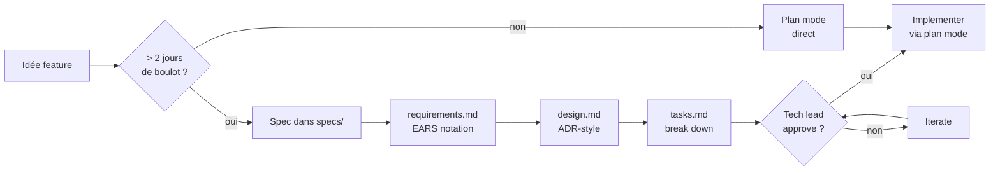

# Module 12 — Process GenAI en équipe (Avril 2026)

> *« 75 % des devs adoptent l'IA, peu d'orgs voient un gain de vélocité mesurable parce qu'il n'y a pas de structure ni de stratégie. »* — Faros AI, 2025.

L'individu sénior qui maitrise plan mode, hooks, et evals double sa productivité. Une **équipe** qui n'a pas de process partagé voit chaque membre faire ça différemment, créer des conflits de conventions, dupliquer du travail, et ne capitaliser sur rien. Ce module est sur la *coordination*.

## 1. Ce qui change quand on passe de 1 dev à N devs



Symptômes du chaos sans gouvernance :

- Chacun a son `.cursorrules` / `CLAUDE.md` / `.windsurfrules` privé.
- Les hooks de l'un cassent les commits de l'autre.
- Les skills sont rebuilt 3× par 3 personnes différentes.
- Pas d'eval partagée → personne ne sait si un changement de prompt régresse globalement.
- Le coût explose : pas de budget, pas d'observabilité par tenant, power user à $50/jour.
- Pas de review structurée des PRs IA — review humaine surchargée ou rubber-stamping.

## 2. Les rôles dans une équipe IA-native (2026)



| Rôle | Responsabilité principale | Hat ou poste dédié ? |
|---|---|---|
| **Tech lead / Staff IA-native** | System design, conventions, gates en CI, ownership architecture | 1 par 5–10 devs (souvent un staff eng « hat ») |
| **Context engineer** | AGENTS.md, skills, prompts partagés, tool descriptions | Hat (souvent porté par 1–2 dans l'équipe), full-time chez les boites > 50 devs |
| **Eval engineer** | Golden datasets, LLM-judges, CI gates, regression detection | Hat puis dédié quand > 10 features IA en prod |
| **App engineers** | Implémentent les features avec les outils de l'équipe | Tous les devs |
| **Ops / observability** | Coûts par feature/tenant, traces multi-agent, alerting | Hat partagé avec ops classique, devient dédié à scale |
| **AI Data Specialist** (Notion) | Maintient les rubriques d'eval par feature, calibre les LLM-judges | Dédié à scale |

> **Le hat le plus négligé** : l'eval engineer. C'est *le* multiplicateur d'équipe — sans evals partagées, chaque dev re-vérifie tout à la main.

## 3. Single source of truth — la gouvernance du repo

### `AGENTS.md` partagé, court, versionné

Pattern qui marche à scale (60 K+ repos sur GitHub en 2026) :

- **Un seul `AGENTS.md`** au top-level, ≤ 80 lignes, tool-agnostique.
- **Commit** comme du code normal — review en PR.
- **Modifications via PR** avec template *« quel est l'impact agent ? »*.
- Un *steward* (souvent le tech lead) approuve les changements impactant.

```markdown
<!-- AGENTS.md template d'équipe -->
# Project: <name>

## Owner
- Tech lead: @flo (decisions on AGENTS.md changes)
- Context: this is a SINGLE-SOURCE-OF-TRUTH file. Don't fork into .cursorrules / CLAUDE.md.

## Stack
[…]

## Conventions
[Numerotées et non-overlapping]
1. Server Actions: validate inputs with Zod, re-auth via verifySession().
2. AI: model strings via Gateway, never instantiate provider clients directly.
[…]

## Don't
[Avec rationale, courte]
1. Don't put authz logic in proxy.ts (CVE-2025-29927). Re-verify in pages/actions.
2. Don't write .cursorrules — see Owner section.

## When in doubt
- Ask in #ai-eng (internal).
- Default to plan mode for any 3+ file change.
```

### `.claude/skills/` versionné en équipe

```
.claude/
├── skills/                      # versionnés
│   ├── stripe-webhooks/
│   ├── auth-flows/
│   └── design-system/
├── agents/                      # versionnés
│   ├── security-reviewer.md
│   ├── api-design-reviewer.md
│   └── migration-helper.md
├── settings.json                # versionné, hooks team-wide
└── settings.local.json          # gitignored, perso (clés API, paths perso)
```

> **Règle d'équipe** : tout ce qui doit être enforced est dans `settings.json` versionné. Tout ce qui est préférence perso est dans `settings.local.json` gitignored.

### Skills en équipe — qui owne quoi



Pattern Anthropic (centaines de skills internes) : **chaque skill a un steward** (path `CODEOWNERS`-style). Pas de skill orpheline.

## 4. Hooks team-wide vs personnels

| Type de hook | Versionné | Exemple |
|---|---|---|
| **Team-wide enforced** | `settings.json` versionné | `PreToolUse Bash` qui block les destructive commands ; `PostToolUse Edit` qui run prettier+eslint |
| **Team-wide soft** | `settings.json` versionné | `UserPromptSubmit` qui inject le statut CI courant |
| **Personnel** | `settings.local.json` gitignored | Notification macOS quand l'agent termine |
| **CI / batch** | `.claude/scripts/` + workflow GitHub | Hook qui run sur les PRs IA pour audit |

Failure mode classique : un dev ajoute un hook bloquant (`PreToolUse` deny on Bash) dans `settings.json` partagé sans communiquer. Tout le monde voit son agent bloqué pendant un sprint. **Mitigation : règle d'équipe — toute modification de hooks team-wide passe en review PR avec préavis #ai-eng.**

## 5. Code review avec agents — le bon process

### La hiérarchie des reviewers en 2026



### Qui review quoi

| Couche | Focus | Bloquant ? | Outil |
|---|---|---|---|
| **AI reviewer** | Bugs ligne-à-ligne, anti-patterns, sécurité bas niveau | **Non** (advisory) | Greptile (82 % bug catch), CodeRabbit, Bugbot |
| **CI gates** | Compile, types, lint, tests unitaires | Oui | GitHub Actions standard |
| **Eval gates** | Régression de prompts, LLM-as-judge thresholds | Oui (sur changes IA-related) | Promptfoo, Braintrust |
| **Mutation gates** | Tests qui kill les mutants | Oui (sur changes au code testé) | Stryker / mutmut |
| **Security gates** | Secrets, license, prompt injection scan | Oui | Trufflehog, Lakera, Garak |
| **Human reviewer** | Design, architecture, business logic, ownership | Oui | Le humain |

### Règle clef : ne jamais bloquer la review humaine sur des commentaires AI individuels

Greptile/CodeRabbit produisent ~5–20 commentaires par PR. Bloquer sur chaque rate la valeur — le humain devient un AI-comment-resolver et non un reviewer architecture.

> **Process qui marche** : AI reviewer commente, le humain *décide* d'addresser ou de dismiss avec rationale. La PR ne merge pas sans approbation humaine, mais les commentaires AI sont resolvable au déclaratif.

### Le reviewer humain en 2026

Le job a changé. Avant :

- Cherche les bugs.
- Vérifie les conventions.
- Lit chaque ligne.

Maintenant :

- L'AI reviewer + CI gates ont déjà fait ça.
- Le humain focus sur : *est-ce que c'est la bonne abstraction ? Est-ce que ça respecte le bounded context ? Est-ce que ça intoduit une dette future ? Le design fait-il sens ?*
- Time per PR review : **divisé par 3** — mais focus plus haut niveau.

## 6. Spec-driven dev en équipe

Cf. module 03 §4. En équipe, voici le workflow :



### Qui écrit les specs ?

- **Le dev qui prendra l'implem** drafte la spec.
- **Le tech lead approuve** avant implem.
- **Stakeholders produit** valident `requirements.md` (EARS).
- **Architects ou senior eng** review `design.md`.

### Format imposé par l'équipe

Les specs longues meurent. Imposez :

- `requirements.md` ≤ 100 lignes
- `design.md` ≤ 200 lignes
- `tasks.md` ≤ 50 items

Si ça déborde : la feature est trop large, la décomposer.

### Specs vs PRs

- La spec est le **what + why**.
- La PR est le **how**.
- Pas de PR sans spec (pour features > 2 jours).
- Pas de spec sans approve.

## 7. Eval-driven team workflow

L'eval engineer (ou hat) est responsable de :

### Golden datasets partagés

```
evals/
├── support/
│   ├── golden.jsonl              # 100+ cases, ground truth
│   └── promptfoo.yaml
├── search/
│   └── …
├── agents/
│   ├── security-reviewer/
│   │   ├── golden.jsonl
│   │   └── promptfoo.yaml
│   └── …
└── shared/
    └── judges/                   # LLM-judge prompts validated
```

### Workflow new feature

1. Feature mergée → **eval engineer crée le golden set** dans la même PR (ou follow-up dans la semaine).
2. CI gate ajoute le golden set au runner.
3. Toute PR future qui touche ce feature path **doit passer le gate**.
4. Si un golden case fail → feature engineer + eval engineer pair pour décider : *vraie régression* ou *spec a évolué* ?

### Calibration LLM-judges

Anti-pattern : un dev ajoute un LLM-judge sans calibration → produit des labels random → tout le monde fait confiance.

> **Règle d'équipe** : tout LLM-judge nouveau passe par 50+ labels humains avant utilisation en CI. TPR ≥ 0.85, TNR ≥ 0.85.

L'eval engineer maintient un dashboard interne : *« quels judges sont calibrés, sur quels datasets, quand ont-ils été re-validés ? »*

## 8. Coût et budget

### Per-dev budget

```
Power user (Anthropic, Cursor) :  > $1k/jour
Senior IA-native               :  $50–200/jour
Dev classique avec adoption     :  $5–30/jour
Dev qui découvre                :  $1–10/jour
```

Posture sénior : pas de cap dur, mais **tracking** par dev. Le tech lead voit qui dépense quoi, et discute si l'usage semble inutile.

> Anthropic interne : pas de cap, mais transparence totale. Encourage les power users (qui produisent plus que leur coût) sans pénaliser les profils qui n'en ont pas besoin.

### Per-feature budget

Pour les features IA en prod, monitorer :

- $ par user actif.
- $ par appel.
- Cache hit rate (target > 50 %).
- Token utilization (input/output ratio).

Alerter quand :

- Spike > 2× la moyenne 7d → potential abuse ou bug.
- Cache hit rate s'effondre → prefix change involontaire.
- Cost par user p99 explose → power user à investiguer.

### Cost dashboards à monter

L'ops engineer (ou hat) construit :

- Dashboard global (Vercel AI Gateway analytics + Langfuse / Helicone).
- Drill-down par feature, par tenant, par modèle.
- Alertes Slack sur seuils.

## 9. Onboarding d'un nouveau dev IA-native

### Première semaine

- **Jour 1–2** : lire AGENTS.md complet. Identifier 3 conventions à clarifier.
- **Jour 3** : install Claude Code + Cursor, clone `.claude/skills` + `settings.json`. Run `claude` sur le repo, lire les hook outputs.
- **Jour 4–5** : observer un sénior en pair sur 2 PRs (plan mode → exec → verify).

### Premier mois

- **Plan mode obligatoire** sur tout PR multi-fichier (gating par tech lead).
- **Eval gate obligatoire** sur tout change de prompt.
- **Pair sur les 3 premières PRs IA-driven** avec un sénior.
- **Self-audit** : à la fin du mois, lister les hooks qu'ils ont activés, les skills qu'ils ont écrites, les évals qu'ils ont créées.

### Métriques d'onboarding

À tracker pour valider l'onboarding :

- % de PRs passées par plan mode (cible : > 80 % en mois 2).
- # de skills contribués (cible : ≥ 2 en 3 mois).
- # de golden cases ajoutés aux datasets de feature qu'ils touchent.
- Coût quotidien moyen (cible : monter à profile sénior).

## 10. Anti-patterns de team

| Anti-pattern | Symptôme | Mitigation |
|---|---|---|
| **Chacun son `.cursorrules`** | Conventions divergent, conflicts | AGENTS.md unique, versionné |
| **Pas de steward sur les skills** | Skills orphelines, contradictoires | CODEOWNERS-style sur `.claude/skills/` |
| **Hooks bloquants ajoutés sans préavis** | Sprint bloqué pour tout le monde | PR + #ai-eng préavis |
| **Eval gate optionnel** | Régressions de prompt en prod | CI gate dur sur changes IA-related |
| **AI review bloquant sur commentaires individuels** | Reviewer humain submergé | Advisory + dismiss déclaratif |
| **Tech lead approve sans spec** | Features qui dérivent | Pas de PR > 2j sans spec approuvée |
| **Power user invisible** | Coût cassé, secrètement | Dashboard transparent par dev |
| **Onboarding sans pair** | Nouveau dev fait n'importe quoi pendant 3 mois | Pair obligatoire les 3 premières PRs IA |
| **Pas de judge calibré** | Évals optimisent du bruit | 50+ labels humains avant use |
| **Skills jamais updates** | Conventions obsolètes | Audit trimestriel — supprimer celles non-déclenchées en 30j |

## 11. Études de cas équipe

### Anthropic (interne)

- Boris Cherny (staff eng) : ~5 Claude en parallèle, 20–30 PR/jour.
- 80–90 % de Claude Code écrit par Claude.
- Pas de cap dur sur dépense ; transparence par dev.
- Title uniforme « Member of Technical Staff » → casse les silos rôle (eng/ML/PM).
- Tools internes : skills/agents partagés en plugin marketplace interne avec badge « Anthropic Verified ».

### StrongDM Software Factory (Simon Willison, fév. 2026)

> Règles internes : *« le code n'est ni écrit ni reviewé par humains »*.

Possible *parce que* :

- Suite de **scenarios** (user stories held-out) avec digital twins (Okta/Jira/Slack en binaires Go).
- Coût acceptable : ~$1k tokens/jour/engineer.
- Eval team dédiée maintient les scenarios.

> **À ne pas reproduire** sans la même infra de scenarios + digital twins. Le « dark factory » sans gates est une catastrophe.

### Spotify

- Plus aucun humain n'écrit le code de production depuis déc. 2025.
- ~650 PR IA / mois mergées.
- –90 % temps sur les migrations.
- Emphasis explicit : *« si ça n'existe pas comme API utilisable par les agents, ça n'existe pas »* → tooling first.

### Cursor

- 35 % des PR mergées proviennent d'agents cloud autonomes.
- Eat their own dog food : Cursor agents qui buildent Cursor.
- Internal tooling : background agents avec notifications Slack/mobile.

### Notion

- *AI Data Specialists* dédiés (eval engineers) maintiennent les rubriques par feature.
- LLM-as-judge avec critères custom par feature.
- Specialized fine-tuned models pour les sub-tasks (cuts latency in half).

## 12. Checklist sénior d'équipe

À adopter dans votre équipe :

- [ ] Un seul `AGENTS.md` (≤ 80 lignes), versionné, en single source.
- [ ] `.claude/settings.json` versionné, `settings.local.json` gitignored.
- [ ] Stewards explicites sur chaque domaine de skill (CODEOWNERS-style).
- [ ] Hooks team-wide soumis à PR + préavis.
- [ ] AI reviewer (Greptile/CodeRabbit) en advisory, pas bloquant.
- [ ] CI gates : type, lint, tests, **evals**, **mutation**, security.
- [ ] Eval engineer (au moins en hat) responsable des golden datasets et judges.
- [ ] LLM-judges calibrés (50+ labels humains, TPR/TNR ≥ 0.85).
- [ ] Specs obligatoires pour features > 2 jours.
- [ ] Plan mode obligatoire pour PRs multi-fichier.
- [ ] Cost dashboard par dev / par feature / par tenant.
- [ ] Alerting sur spikes, cache miss, power user.
- [ ] Onboarding structuré : pair les 3 premières PRs IA.
- [ ] Audit trimestriel : skills, hooks, judges, datasets.

## Visualisation

Le diagramme [Process et gates en équipe](/diagrammes#team-process) montre comment une PR traverse les gates AI reviewer → CI → evals → human, et les ownerships par couche.

## Ce qu'il faut emporter de ce module

1. **Sans gouvernance partagée, l'IA crée du chaos en équipe.** L'individu devient 2× plus productif, mais l'équipe peut devenir 2× moins.
2. **Single source of truth** : un AGENTS.md, des skills versionnés avec stewards, des hooks team-wide soumis à PR.
3. **Hiérarchie de review** : AI reviewer (advisory) → CI gates (bloquants) → human (architecture). Le humain ne fait plus du line-by-line.
4. **L'eval engineer** est le hat le plus négligé et le plus impactant.
5. **Specs > 2 jours, plan mode tout le temps**, gates obligatoires sur changes IA.
6. **Cost transparency par dev** sans cap dur — encourage les power users sans pénaliser.
7. **« Dark factory » sans gates** est dangereux. StrongDM/Spotify l'ont fait *avec* une infra eval/scenarios massive.

## Sources

- [Faros AI 2025 study on AI adoption ROI](https://www.faros.ai)
- Anthropic — [Equipping Agents for the Real World with Agent Skills](https://www.anthropic.com/engineering/equipping-agents-for-the-real-world-with-agent-skills) (skills team-wide)
- Anthropic — Pragmatic Engineer interview Boris Cherny (mars 2026)
- [StrongDM Software Factory — Simon Willison](https://simonwillison.net/2026/Feb/7/software-factory/)
- [Cursor 3 announcement](https://cursor.com/blog/cursor-3) (background agents team workflow)
- [Notion blog — Speed, Structure, and Smarts](https://www.notion.com/blog/speed-structure-and-smarts-the-notion-ai-way) (AI Data Specialists)
- [GitHub Spec Kit](https://github.com/github/spec-kit) (SDD en équipe)
- [AGENTS.md spec](https://agents.md/) (Linux Foundation Agentic AI Foundation)
- [Greptile benchmarks](https://www.greptile.com/benchmarks) (AI review)
- [Promptfoo](https://github.com/promptfoo/promptfoo) (eval gates en CI)
